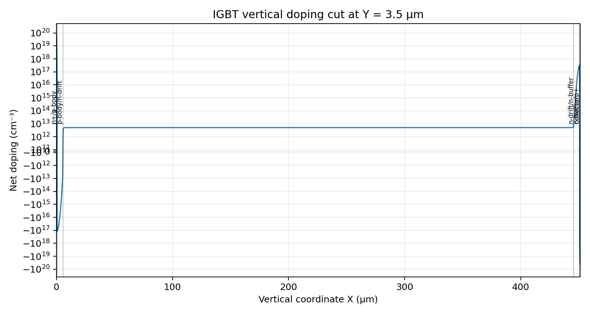
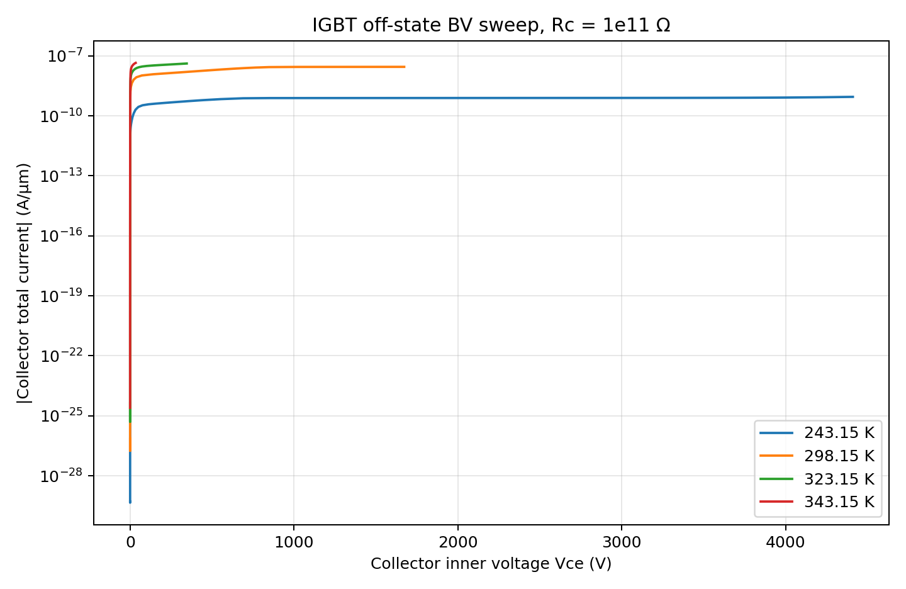

# 首轮 IGBT 四温度关断态 BV 扫描报告

## 范围

本轮只运行 IGBT 基线，不建立 MOS 对照，不加入 TID 的 Not/Nit。复用官方 Power/IGBT 沟槽栅横向几何、栅氧、接触与界面网格策略；纵向净层序按目标参数重建。

## 结构与运行配置

- 总厚度：451.15 µm。
- 净层序：n+ `.65 µm、p-body 5 µm、n-drift 440 µm、n-buffer 5 µm、p+ collector `.5 µm。
- n-drift：5.0e12 cm^-3。
- 高斯标称峰值：n+ 7.0e19、p-body 1.5e17、n-buffer 4.0e17、p+ collector 5.0e19 cm^-3。
- 高斯采用重叠植入：p-body 从发射极表面延伸至 5.65 µm，buffer 从集电极表面延伸 5.5 µm；由净掺杂交叉形成顺序层，避免表面出现未屏蔽 n 型通路。
- 温度：243.15 / 298.15 / 323.15 / 343.15 K。
- 电极：Vg=0 V、Ve=0 V；Collector 外部目标 4500 V，Rc=1e11。
- 物理模型：Thermodynamic、SRH、Auger、HighFieldSaturation、Lackner avalanche。
- 最终远端目录：$remote。
- 本地完整证据：local_runtime/igbt_bv_first_round_run/。

## 网格与层边界验证

SDE/SnMesh 正常结束，最终网格包含 R.Si、R.Gox、R.Si+R.Gox、Emitter、Gate、Collector。Y=3.5 µm 净掺杂切线得到三个 PN 交叉点：

- n+/p-body：约 `.6584 µm；目标 `.65 µm。
- p-body/n-drift：约 5.6501 µm；目标 5.65 µm。
- n-buffer/p+ collector：约 450.6436 µm；目标 450.65 µm。

n-drift/n-buffer 为同型 n/n+ 过渡，无 PN 零交叉；其目标位置为 445.65 µm。

## 四温度最终点

距离由最终网格中 R.Si+R.Gox 的 156 条界面线段计算，不使用截图估算。

| 温度 K | Collector 外压 V | 器件内压 V | Ic A/µm | max(|E|) V/cm | E 坐标 µm | E→栅氧 µm | max(|Jtotal|) A/cm² | J 坐标 µm | J→栅氧 µm |
|---:|---:|---:|---:|---:|---|---:|---:|---|---:|
| 243.15 | 4500 | 4410.60 | 8.940e-10 | 3.164e5 | (0.0493, 1.9815) | 2.38e-10 | 7.621 | (3.2215, 2.5006) | 0.001500 |
| 298.15 | 4500 | 1672.55 | 2.827e-8 | 2.543e5 | (0.0200, 1.9806) | 1.97e-8 | 140.424 | (3.2215, 2.5006) | 0.001500 |
| 323.15 | 4500 | 345.39 | 4.155e-8 | 1.288e5 | (0.0000, 3.9000) | 1.0800 | 241.951 | (1.0172, 2.7899) | 0.001500 |
| 343.15 | 4500 | 33.90 | 4.466e-8 | 1.234e5 | (0.0000, 3.9000) | 1.0800 | 338.986 | (1.0172, 2.7899) | 0.001500 |

## 验收判断

- 四个 BV 节点均正常结束，生成 .stdout、.log、.plt 和最终 .tdr；未检出仿真失败终止。
- 四个最终 TDR 均包含电场、总电流密度、晶格温度和 ImpactIonization（Lackner avalanche 对应输出）分布。
- Rc=1e11 使高温分支在外部 4500 V 时产生显著压降，因此必须区分 Collector 外压与器件内压；本轮不能把四个最终 TDR 都称为“器件实际承受 4.5 kV”。
- **不满足“高场和最大电流密度都远离栅氧”的验收条件。** 243.15 K 与 298.15 K 的最大电场落在 Si/栅氧界面；四个温度的最大总电流密度均位于距该界面约 `.0015 µm 的首层硅网格点。
- 因此本轮结论是：当前 IGBT 基线没有证明峰值远离栅氧，反而显示局部总电流密度峰值贴近沟槽栅氧界面；不能据此声称 IGBT 相对 MOS 的空间优势。

## 证据索引

- 运行 deck：local_runtime/igbt_bv_first_round_run/BV_*K.cmd、sde_dvs.cmd。
- 网格：rtifacts/igbt_bv_msh.tdr、rtifacts/igbt_bv_msh.log。
- 曲线：rtifacts/Icollector-Vce_*.plt、根目录同名 CSV。
- 最终场分布：rtifacts/bv_*K.tdr。
- 四温度 × 四物理量图片：rtifacts/*K_electric_field.png、*K_total_current_density.png、*K_temperature.png、*K_avalanche_generation.png。
- 汇总：summary.json、summary.csv。
