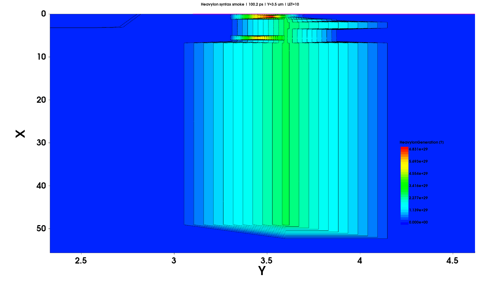

# 有界自治 TCAD 的预注册可审计复现方法：IGBT 重离子单粒子烧毁案例的阶段性验证与偏差诊断

> 文稿状态：阶段性工作底稿。四个论文锚点尚未完成，本文不能据此宣称 IGBT SEB 物理复现成功。

## 摘要（草稿）

TCAD 论文复现不仅要求仿真能够运行，还要求参数映射、求解失败、适应性调整和物理分类之间保持可审计的边界。本文提出一个面向 TCAD 复现任务的预注册有界自治工作流，并以 4.5 kV 沟槽栅 Si IGBT 的 HeavyIon/单粒子烧毁（single event burnout, SEB）仿真作为案例。工作流在首次 HeavyIon 运行前冻结器件基线、环境、论文锚点、允许调整项、停止条件和四分类规则；运行阶段使用互不覆盖的 attempt 谱系、公开脱敏事件账本和私有原始产物账本记录失败与恢复。100 V smoke 验证了 HeavyIon 语法、实际偏压、瞬态生成率和约 50 µm 的入射轨迹。首个正式锚点 A01（2500 V、LET 15 MeV·cm²/mg）在最长基准网格观察中推进至 81.933 ns，最高晶格温度为 395.229 K；完整脉冲电荷审计在三个径向宽度下均通过 5% 门。统一 solver 消融没有产生达到接受门的候选。核心轨迹半步网格在 50/60 ns 的 Collector 电流相对基准差异为 `-6.19%/-15.23%`，局部雪崩证据也显著分叉。`Wt_hi=0.1/0.2/0.5 µm`、300 K 非热稳态初态及 Y=3.4/3.5/3.6 µm 对照均未恢复参考论文约 10 ns 后的电流衰减。因此 A01 以 `INDETERMINATE(time_window_short_and_mesh_sensitive)`、`ANCHOR_MISMATCH` 和 `MESH_SENSITIVE` 三字段关闭，A02–A04 未进入。该结果支持“输入链路可信、负结果与停止决策可审计”，不支持 SEB/NO_SEB 分类、四锚点复现、效率优越性或阈值外推。

**关键词：** TCAD；有界自治；预注册；可复现性；绝缘栅双极型晶体管；重离子；单粒子烧毁；证据账本

## 1 引言

器件级 TCAD 复现常同时包含物理映射、数值求解和证据管理三个问题。论文可能给出器件层厚、掺杂、偏压和若干代表性曲线，却不一定完整披露径向能量沉积宽度、热边界、网格细节、时间步策略和求解器 restart 方式。复现者必须补充实现假设，但这些假设一旦与物理参数调整混在一起，便容易出现两类不可审计结果：其一，把普通数值失败解释为器件烧毁；其二，通过事后修改结构或参数追逐目标曲线，却仍将结果表述为论文复现。

自治代理可以执行长链条的文件检查、仿真提交、结果提取和失败恢复，但自动化本身不保证物理结论可靠。对于单粒子烧毁这类热电强耦合问题，停止原因、实际器件偏压、离子生成率、时间窗和温度阈值共同决定分类。若代理只以进程退出码或求解器报错为目标，它可能得到工程上“完成”的任务，却产生物理上不可辩护的结论。本文关注的不是让代理自由寻找最接近论文的参数，而是约束其在预注册边界内运行，并保留足以复核每次决策的证据。

Peng 等研究了 4.5 kV Si IGBT 的大气中子诱发 SEB，并使用 TCAD 分析二次离子引发的电流、冲击电离、寄生 NPN 开启和热失控过程 [@peng2024_atmospheric_neutron_seb]。该论文给出了器件纵向参数、HeavyIon 锚点和若干关键时刻，适合作为有明确目标但仍存在未披露实现细节的复现案例。本文将其四个定性锚点转化为串行证据门槛，用于观察自治工作流能否守住模型边界、识别无效路径，并在证据不足时拒绝分类。

本文当前版本回答四个问题：

1. 有界自治工作流能否在预注册的模型、调整和停止边界内执行 IGBT HeavyIon/SEB 复现？
2. 偏压、轨迹、生成率、时间窗和物理阈值组成的证据门控，能否避免把数值失败或时间窗不足误判为 SEB/NO_SEB？
3. attempt 谱系、公开事件账本和私有原始产物能否形成可追溯的失败恢复链？
4. 在上述约束下，本模型能否复现参考论文的四个定性锚点？

前三个问题已有过程证据；第四个问题在 A01 即出现锚点不匹配，因此 A02–A04 未进入。本文不评价 Codex 相对人工或其他代理的普遍优劣，也不把单一二维单位胞的结果外推至封装级烧毁能量。

> 待补文献：TCAD 可重复性、计算实验预注册、自治科学代理治理和单粒子效应仿真报告规范。补充文献前不扩写领域普遍性主张。

## 2 研究设计与方法

### 2.1 研究类型与阶段边界

本研究是单器件、单代理、单 Sentaurus 版本的前瞻性有界自治案例。四温度关断态 BV 工作发生在正式预注册之前，仅作为回顾性 pilot，用于验证结构、网格、输出字段和证据归档链。HeavyIon/SEB 阶段在第一次 HeavyIon 运行前冻结 Git 状态、主机和虚拟机环境、Sentaurus 版本、基线 deck 与网格哈希、锚点顺序、分类规则和停止条件。

研究对象是二维 IGBT 单位胞的局部热电响应。现阶段不建立 MOSFET 对照，不加入 TID `Not/Nit`，不从二维结果估算整个封装器件的烧毁能量。物理复现与自治过程评价分开：前者由四个锚点和机理场证据判断，后者由边界合规、失败保留、决策可追溯性和产物完整性判断。

### 2.2 预注册的自治边界

代理被允许执行语法核查、实际偏压核查、离子轨迹与生成率积分、时间步收敛、局部网格复核和 `Wt_hi` 的有界敏感性检查。每次调整必须建立新的 attempt，并记录父运行、触发证据、预期效果、实际效果和接受状态。代理还可以依据运行证据选择线程数，或使用求解器原生 restart 减少重复偏压爬升。

禁止项包括修改漂移区或其他掺杂、几何和层厚以追逐论文结果，引入 TID 参数、添加未经记录的热模型变化，以及在四锚点通过前启动完整 `VCE × LET` 扫描。普通 `ExitOnFailure`、最小时间步耗尽或进程退出不能单独作为 SEB 证据。只有在凭据或许可证持续不可恢复、继续运行必须越过预注册边界、关键论文事实缺失或用户主动改变范围时，才计为人工干预并停止自治执行。

### 2.3 证据架构与状态流

每个 case 由不可覆盖的 attempt 序列组成。公开账本记录非敏感的事件时间、case、动作、原因、观察结果、退出码、证据路径、人工干预和决策范围；私有账本保留完整命令、stdout/stderr、PLT/TDR、deck、参数快照和远端路径。公开 `artifact_manifest.csv` 使用哈希连接可发布图表与私有原件，避免把大型场文件、许可证信息或私有运行路径写入版本库。

状态判断遵循以下流程：

```text
论文事实与项目假设分层
        ↓
冻结基线、锚点、判据与允许调整
        ↓
新建 case/attempt → 运行 → 保存原始产物
        ↓
核查实际偏压、输入链路、时间窗和物理量
        ↓
满足判据则分类；证据不足则 INDETERMINATE
        ↓
记录调优事件并派生新 attempt，禁止覆盖历史
```

当阶段报告与最新账本冲突时，以可机读的 case closure 和事件 closure 为当前事实源。本文证据截止到事件 E0044。较早文档中的 A01 attempt04 运行中观察值 78.304 ns、PA01 并行探索提案和旧 50 ns 网格差异均作为历史状态保留；当前状态以 `a01_diagnostic_gate_summary.csv` 和经重提取的诊断 CSV 为准。

### 2.4 IGBT 结构与物理模型

参考论文的 TCAD 结构包含 0.65 µm n+ emitter、5 µm p-body、440 µm n-drift、5 µm n-buffer 和 0.5 µm p+ collector。对应标称掺杂分别为 `7.0e19`、约 `1.5e17`、`5.0e12`、约 `4.0e17` 和 `5.0e19 cm^-3` [@peng2024_atmospheric_neutron_seb]。本项目按该纵向层序重建结构，并用 Y=3.5 µm 的净掺杂切线验证三个 PN 交叉点约为 0.6584、5.6501 和 450.6436 µm。

正式 HeavyIon 模型使用 `Thermodynamic`、`SRH`、`Auger`、`HighFieldSaturation`、`DopingDependence` 和 Lackner avalanche。正式网格含 31,769 个点和 62,720 个单元，在轨迹核心区和机理观察区局部加密，同时保留栅氧界面、结区与 buffer/collector 加密。

参考论文给出离子从关断器件顶部垂直入射、入射时刻 `1e-10 s`、轨迹长度 50 µm、LET 不超过 15 MeV·cm²/mg [@peng2024_atmospheric_neutron_seb]。本项目映射为 `StartPoint=(0,3.5)`、`Direction=(1,0)` 和 `Length=50 µm`。LET 10 和 15 MeV·cm²/mg 分别换算为 `0.1037` 和 `0.1555 pC/µm`。`Wt_hi=0.1 µm` 与 `s_hi=2e-12 s` 未由论文完整披露，分别作为 Sentaurus 示例假设和项目参数文件假设；它们不能写成参考论文参数。

### 2.5 论文锚点与串行门控

| 锚点 | VCE | LET (MeV·cm²/mg) | 参考论文定性结果 | 本项目进入顺序 |
|---|---:|---:|---|---:|
| A01 | 2500 V | 15 | 约 10 ns 达峰后衰减，无 SEB | 1 |
| A02 | 3000 V | 10 | 无 SEB | 2 |
| A03 | 3000 V | 15 | 电流和温度持续增长，发生 SEB | 3 |
| A04 | 3200 V | 15 | 强 SEB，约 200 ns 时 Tmax 超过 2500 K | 4 |

锚点必须串行运行。A01 未关闭前不得启动 A02；四锚点定性关系未通过前，不进入 `VCE × LET`、入射位置或发布级网格扫描。该门槛用于防止在基础复现尚未成立时生成看似完整但缺少物理锚定的阈值图。

### 2.6 分类规则

- `SEB_CONFIRMED`：Tmax 不低于 1680 K，且离子脉冲后 Collector 电流或功率持续高位或增长。
- `NO_SEB`：Tmax 低于 1680 K，且电流、场和温度在 1 µs 时间窗内恢复或明确衰减。
- `SEB_ONSET`：电流和温度持续增长，但 1 µs 内尚未达到 1680 K。
- `INDETERMINATE`：实际偏压未达标、普通求解失败、时间窗不足或关键输出缺失。

2500 K break criterion 用于限制高温运行成本。触发该条件仍需检查 1680 K 与持续大电流或功率的共同证据；未触发也不自动等于 `NO_SEB`。

### 2.7 过程评价指标

阶段性过程指标包括总尝试数、有效 smoke、正式物理分类数、失败恢复路径、调整接受状态、人工干预、计划外偏离和证据完整性。wall time 和单步速度只在相同时间区间、相同机器与相同产物门槛下比较。由于本研究没有人工基线、其他代理对照或重复运行，当前不把性能观察转换为“效率提升”主张。

## 3 阶段性结果

### 3.1 回顾性四温度 BV pilot

四温度 pilot 的主要作用是验证结构重建、关断态求解、场输出和归档链。Collector 使用 `Rc=1e11`，因此外部目标电压与器件内压必须分开。外部电压均为 4500 V 时，四个最终点如下。

| 温度 (K) | 外部 VCE (V) | 器件内压 (V) | Collector 电流 (A/µm) | Tmax (K) |
|---:|---:|---:|---:|---:|
| 243.15 | 4500 | 4410.60 | `8.940e-10` | 243.361 |
| 298.15 | 4500 | 1672.55 | `2.827e-8` | 301.520 |
| 323.15 | 4500 | 345.39 | `4.155e-8` | 324.237 |
| 343.15 | 4500 | 33.90 | `4.466e-8` | 343.218 |

这些结果不能被称为四个温度下器件均实际承受 4.5 kV。243.15 K 和 298.15 K 的最大电场落在 Si/栅氧界面附近，四个温度的最大总电流密度也接近该界面，因此 pilot 不支持“IGBT 高场和电流峰值远离栅氧”的空间优势主张。

### 3.2 HeavyIon smoke

第一次 smoke 在 100 V、LET 10 MeV·cm²/mg、Y=3.5 µm 和 2 ns 条件下完成，但 pre/final 保存时刻错过了有限宽度的 Gaussian 脉冲。工作流没有修改 HeavyIon 物理参数，只增加 100-102 ps 附近的 snapshot。第二次 smoke 捕获到峰值 `HeavyIonGeneration=6.8313e29 cm^-3 s^-1`，轨迹从器件表面延伸至约 49.08 µm，实际 VCE 为 100.0 V。该结果关闭了语法、偏压、入射位置、方向和输出时刻的证据缺口，状态记为 `SMOKE_VALID`，不作 SEB 分类。



### 3.3 A01 尝试谱系

A01 固定为 2500 V、LET 15 MeV·cm²/mg、Y=3.5 µm 和正式局部网格。四次尝试均未修改结构、掺杂、HeavyIon 输入或热模型。

| Attempt | 关键动作 | 到达时间 | Tmax | 峰值 Ic | 结果 |
|---|---|---:|---:|---:|---|
| attempt01 | 首次冻结策略运行 | 33.737 ns | 325.571 K | `1.579e-4 A/µm` | `INDETERMINATE(time_window_short)` |
| attempt02 | 尝试普通 Plot TDR restart | NA | NA | NA | 启动失败；`INDETERMINATE(numerical_failure)` |
| attempt03 | 原始网格 ramp，创建原生 Save，8 线程 | 59.583 ns | 338.927 K | `6.726e-4 A/µm` | `INDETERMINATE(time_window_short)` |
| attempt04 | 原生 Load，恢复单线程 | 81.933 ns | 395.229 K | `3.172e-3 A/µm` | `INDETERMINATE(time_window_short_and_stiff)` |

Attempt02 说明可视化所需的 Plot TDR 不等于一致的求解器状态。Attempt03 从原始正式网格重新完成偏压爬升，并使用 solver-native `Save` 生成 2500 V restart；attempt04 的 `Load` 成功接受该状态并直接进入瞬态。该恢复链消除了重复 DC ramp，但没有改变物理模型。

Attempt03 的八线程瞬态在后期出现接近 38 s 的单步 wall time。Attempt04 恢复单线程后，启动阶段单步约 2.7-2.8 s。两者所处瞬态区间不同，因此当前只能说明“增加线程未在本案例中产生预期收益”，不能据此给出通用加速比。

### 3.4 A01 长时间窗观察与论文偏差

Attempt04 的实际 VCE 为 2500 V，满足偏压容差。运行在冻结产物后正常中断于 81.933 ns，Tmax 为 395.229 K，峰值 Collector 电流和功率分别为 `3.172e-3 A/µm` 与 `7.931 W/µm`，累计 876 次 Newton 重试。该时间窗远短于预注册的 1 µs，Tmax 也未达到 1680 K，所以既没有 `NO_SEB` 所需的恢复证据，也没有 `SEB_CONFIRMED` 所需的温度证据。

参考论文在 2500 V、LET 15 MeV·cm²/mg 下报告电流约 10 ns 达峰后逐渐衰减 [@peng2024_atmospheric_neutron_seb]。本项目基准网格在 10–81.933 ns 持续增长，没有出现相同趋势。该观察只构成 `ANCHOR_MISMATCH`，不能从短时间窗增长直接推导真实 SEB。

### 3.5 输入电荷与数值消融

W-2024.09 手册给出的二维 Gaussian 默认厚度为 1 µm。使用 92–108 ps 的 16 个唯一场状态积分，`Wt_hi=0.1 µm` 的总电荷为 `8.067321 pC`，相对名义 `7.775 pC` 偏差 `+3.7598%`；`Wt_hi=0.2/0.5 µm` 的对应偏差为 `+4.340%/+4.589%`，均通过 5% 门。此前 98–102 ps 得到的低值属于窗口截断，不是少注入证据。

使用同一 40 ns 原生 Save 的 solver 消融中，降低 Iterations 的 B1 比基线慢 26.9%；进一步降低 Increment 的 B2 在 1200 s 预算内只到 51.746 ns；关闭 Extrapolate 的 B3 快 8.2%，但低于预注册的 10% 接受门。三个候选均被拒绝，正式 solver 保留基线 A。

### 3.6 网格、径向宽度、热初态与位置诊断

核心轨迹四项步长减半后，网格从 31,769 点、62,720 单元增加到 70,276 点、139,710 单元。通过同网格原生 Save 分段恢复建立 2500 V 初态后，半步网格完成到 60 ns。相对基准网格，10/40 ns 端电流接近，50/60 ns 差异扩大为 `-6.19%/-15.23%`；沿轨迹 `ImpactIonization` 和 p-body 电势代理也发生明显分叉。因此该分支关闭为 `MESH_SENSITIVE`，而不是网格收敛。

`Wt_hi` 从 0.1 µm 增至 0.2/0.5 µm 可使 60 ns 电流最多降低约 18.6%，但 0.2 与 0.5 µm 仅差约 0.63%，且全部持续增长。将 2500 V 初态人为保持在 300 K 后，60 ns 电流反而比正式热稳态基准高约 6.9%。Y=3.4/3.6 µm 相对 Y=3.5 µm 均降低 60 ns 电流约 18%，但三个位置仍持续增长。这些结果表明幅值对未披露参数和局部离散化敏感，却没有任何受控变体恢复论文衰减。

### 3.7 当前锚点矩阵

| 锚点 | 当前状态 | 论文匹配/网格评估 | 后续门控 |
|---|---|---|---|
| A01 | `INDETERMINATE(time_window_short_and_mesh_sensitive)` | `ANCHOR_MISMATCH`；`MESH_SENSITIVE` | 已关闭，不形成 SEB/NO_SEB 分类 |
| A02 | `NOT_ENTERED(anchor_gate_failed)` | 未验证 | 等待新的阶段决策 |
| A03 | `NOT_ENTERED(anchor_gate_failed)` | 未验证 | 等待新的阶段决策 |
| A04 | `NOT_ENTERED(anchor_gate_failed)` | 未验证 | 等待新的阶段决策 |

因此，四锚点复现率、阈值矩阵、正式位置效应和网格无关性均不计算。Y=3.4/3.6 µm 结果只作为 A01 局部诊断，不冒充预注册的正式位置扫描。

## 4 讨论

### 4.1 有界自治的阶段性能力

当前最明确的结果不是 SEB 复现成功，而是工作流能够保留失败并拒绝过早分类。第一次 smoke 缺少生成率截图时，代理只调整输出调度；普通 Plot TDR restart 失败后，该路径没有被覆盖或隐去；八线程未产生预期加速时，线程策略被回退。上述决策均可从 parent run、event 和 tuning 记录回溯到触发证据。

这种过程控制把“仿真完成”拆成多个独立门槛：输入被求解器接受、实际偏压达标、关键物理量在正确时刻被保存、时间窗足以分类、物理阈值与趋势共同满足。A01 的进程能够持续推进，但证据门控仍将其判为 `INDETERMINATE`。这正是方法设计希望保留的差别。

### 4.2 可审计失败与物理复现失败

A01 的输入链路已通过偏压、轨迹、脉冲电荷和 restart 证据核验，solver 消融也未改变增长方向；但半步网格证明晚时刻端电流和局部雪崩反馈未收敛。因此，当前不能把偏差缩减为单一数值故障，也不能把增长解释为真实 SEB。三字段门控保留了这一区分：物理分类证据不足、论文趋势不匹配、网格评估失败。

该结果展示了负结果记录的实际作用。工作流没有选择使晚时刻电流更低的 `Wt_hi` 或位置作为“最佳参数”，也没有因冷态对照更接近名义 300 K 就替换正式初态。受控变体均保留后，停止主张比事后挑参获得表面匹配更可辩护。

### 4.3 参考论文未披露参数的影响边界

`Wt_hi`、二维单位胞宽度、横向能量分布、Avalanche/迁移率参数、`AnalyticTEP`、热边界和横向几何可能影响瞬态电流与温升。本文已按 `0.1/0.2/0.5 µm` 顺序完成 `Wt_hi` 敏感性，并证明其主要改变晚时刻幅值而未逆转趋势。热初态与局部位置对照得到相同方向的结论。

这些诊断不能消除模型不确定性。尤其是 Avalanche、热边界和横向几何若继续变化，将不再只是执行层调优，而是新的模型偏离研究；必须另行预注册，不能回写为本次锚点复现成功。

### 4.4 有效性威胁

内部有效性受到 A01 时间窗不足、Newton 重试密集、晚时刻网格敏感及缺少重复运行的限制。HeavyIon 电荷闭合排除了明显总注入量错误，但不证明局部沉积分布和二维归一化具有唯一映射。基准与半步网格在早期一致、晚期分叉，也说明只核查 10 ns 不足以验证正反馈瞬态。

构念有效性取决于分类规则能否代表 SEB。本文采用约 1680 K 与持续大电流或功率的联合判据，并将 1 µs 内恢复作为 `NO_SEB` 条件。该规则比退出码更接近物理过程，但当前 A01 未达到任一完整分类门，故只允许 `INDETERMINATE`。

外部有效性受到单一 IGBT、二维结构、单一 Codex 配置和 Sentaurus W-2024.09 的限制。Y=3.4/3.6 µm 只是局部离散化诊断，不代表正式三位置扫描。当前没有人工基线、其他代理对照、跨器件重复或独立第三方复算，因此不能主张代理优越性或方法已经普遍有效。

### 4.5 后续实验

A02–A04 当前均为 `NOT_ENTERED(anchor_gate_failed)`。若研究目标保持“首次预注册论文复现”，应冻结本次负结果，不再通过模型级改动追逐 A01。若目标改为“复现偏差分析”，则应对 Avalanche、`AnalyticTEP`、迁移率、热边界或横向几何建立新的单变量协议和独立成功标准。

若未来需要回答“自治调优是否节省时间”，应另行预注册对照设计。对照至少需要相同机器、相同物理时间窗、相同初始状态、相同产物验收门槛，以及固定策略或人工审计流程；否则不同瞬态区间的 wall time 不能形成效率因果结论。

## 5 结论（A01 诊断闭合稿）

本文建立了一个用于 TCAD 论文复现的预注册有界自治工作流，并在 IGBT HeavyIon/SEB 案例中形成了可追踪的 attempt、事件、调优和产物链。100 V smoke、实际 2500 V 偏压与完整脉冲电荷证明输入链路可运行；普通 Plot TDR restart、并行负加速和未达接受门的 solver 候选均作为负结果保留。

A01 的所有受控变体在 60 ns 前均保持电流增长，与参考论文约 10 ns 后衰减的趋势不匹配；50/60 ns 端电流及局部雪崩场又表现出网格敏感性。因此，A01 被分离关闭为 `INDETERMINATE(time_window_short_and_mesh_sensitive)`、`ANCHOR_MISMATCH` 和 `MESH_SENSITIVE`，而不是 `SEB`、`NO_SEB` 或复现成功。A02–A04 与扫描未进入。当前结论限定为：预注册门控和双账本使一次失败的物理复现保持可审计，并阻止了短时间窗、预算耗尽或选择性参数报告被误写为物理结论。

## 数据、代码与产物可用性说明（草稿）

版本库保存预注册、公开事件账本、case 汇总、调优记录、产物 manifest、派生图表和本工作底稿。原论文 PDF、Sentaurus deck 的私有运行副本、大型 TDR/PLT、完整日志、许可证信息和远端私有路径不进入版本库。可发布数据通过 case/attempt ID 和 SHA-256 与私有原件关联。最终公开范围将在投稿前根据软件许可、论文版权和敏感信息检查确定。

## AI 与自动化参与披露（草稿）

本案例由 Codex（记录配置为 `gpt-5.6-sol`）在用户定义并冻结的研究边界内执行环境核查、Sentaurus 运行编排、结果提取、失败恢复建议和阶段文档生成。模型未被授权修改预注册禁止项，也未被授权在证据不足时改变分类规则。公开事件账本截至 E0044；纠错性人工参数干预为 0，另有 1 次用户批准的有界范围决策。研究者仍负责研究目标、边界批准、结果解释、引用核验和最终稿件责任。

## 待补内容清单

- [ ] 系统补充 TCAD 可重复性、计算实验预注册与自治科研代理文献。
- [ ] 决定是否以“有界自治负结果方法学”投稿，或另行预注册模型级偏差分析。
- [ ] 若重开锚点链，严格串行执行 A02–A04，并更新锚点矩阵。
- [ ] 只有获得有效 SEB/NO_SEB 配对后，才生成场、空间电荷、势能、寄生 NPN 和热失控对照。
- [ ] 统一重绘发布级工作流统计图，并执行独立数值与引用核验。