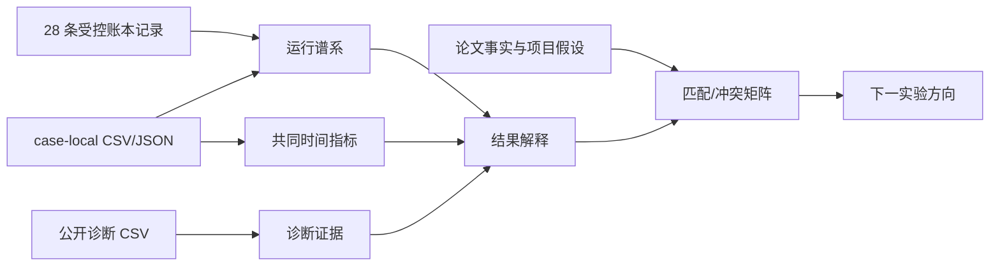
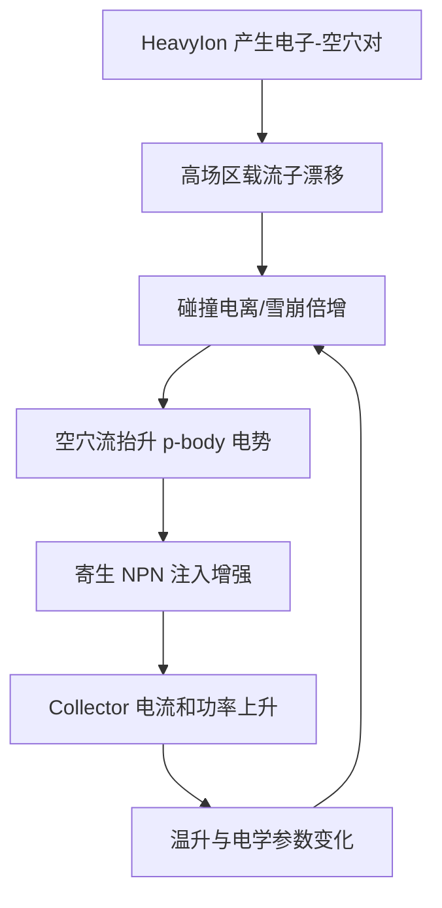
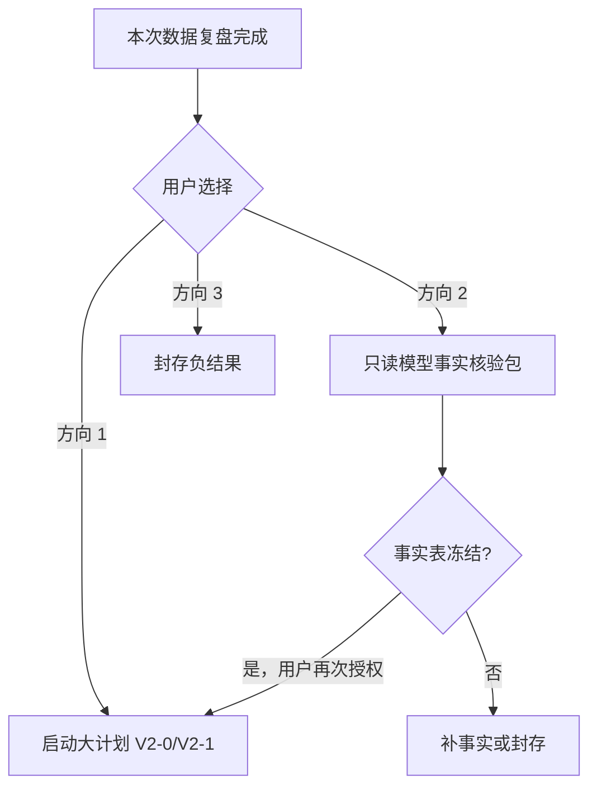
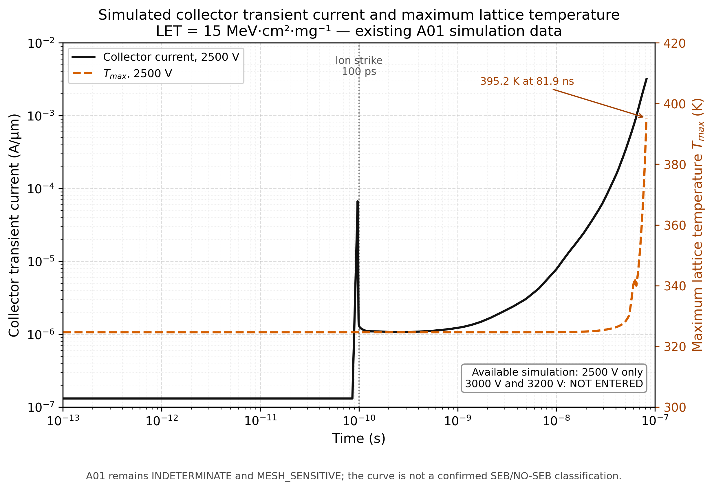
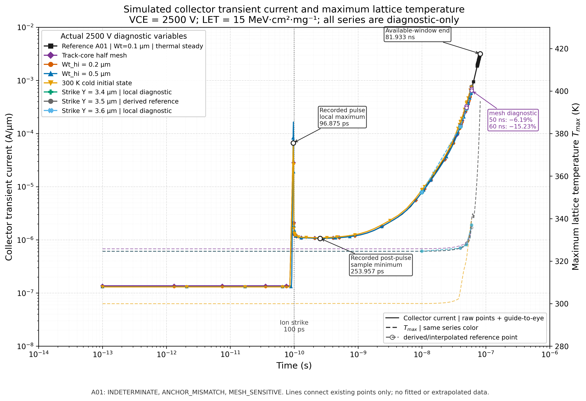

# IGBT SEB 现有仿真数据分析

## Material Passport

- Artifact ID：`IGBT-SEB-EXISTING-DATA-REVIEW-20260713`
- Verification Status：`ANALYZED`
- 数据范围：现有 IGBT HeavyIon/SEB 运行目录、公开 CSV、case-local CSV/JSON 和项目内已核验论文事实
- 未执行事项：未重新运行 TCAD，未修改 deck、网格、物理模型或 V2 协议
- 当前门控：`INDETERMINATE(time_window_short_and_mesh_sensitive) + ANCHOR_MISMATCH + MESH_SENSITIVE`
- 适用范围：解释当前证据，不用于宣称 A01 已分类、四锚点已复现或 SEB 阈值已获得

## 1. 本次复盘回答什么

本次复盘回答四个问题：

1. 现有“30 多轮仿真”究竟包含哪些类型的数据；
2. 这些数据分别能说明什么，不能说明什么；
3. 当前结果为什么与 Peng et al. (2024) 的 A01 锚点冲突；
4. 下一步应先补模型事实、先补网格，还是将当前结果封存为负结果。

数据流为：

派生数据由 [`scripts/build_igbt_seb_analysis.py`](../../../scripts/build_igbt_seb_analysis.py) 生成：

- [`data/运行谱系表.csv`](data/运行谱系表.csv)
- [`data/共同时间指标.csv`](data/共同时间指标.csv)
- [`data/诊断证据表.csv`](data/诊断证据表.csv)

## 2. 运行口径：不是 32 个同等实验

### 2.1 三种计数必须分开

| 口径 | 数量 | 含义 |
|---|---:|---|
| `cases/` 目录 | 32 | 所有保留目录，包括历史审计目录、不完整目录和重复命名的中间目录 |
| `case_summary.csv` 受控记录 | 28 | 当前公开账本认可的运行、审计、恢复或性能探针 |
| 未进入受控账本的目录 | 4 | 不能并入正式统计，也不能用来增加“实验轮数” |

4 个未入账目录是：

- `attempt09_input_audit`
- `attempt10_input_audit_full`
- `attempt16_meshhalf_staged_dc_t1`
- `attempt18_meshhalf_transient_0_60`

因此，严谨表述应是：**当前有 28 条受控运行记录，另保留 4 个未入账或历史中间目录。**

证据：[原始 `case_summary.csv`](../2026-07-11-igbt-seb-paper-reproduction/data/case_summary.csv)、[运行谱系表](data/运行谱系表.csv)。

### 2.2 28 条受控记录的职责分布

| 角色 | 数量 | 能回答的问题 | 不能回答的问题 |
|---|---:|---|---|
| A01 锚点观察 | 4 | A01 是否达到偏压、运行到多长时间、趋势和数值刚性 | 不能因停止或升温直接判 SEB |
| HeavyIon smoke | 2 | 语法、轨迹、生成率快照是否有效 | 不作 SEB 分类 |
| 输入/电荷审计 | 3 | 完整脉冲总电荷是否基本闭合 | 不证明局部沉积分布唯一正确 |
| 数值/线程性能探针 | 7 | restart、solver controls、线程资源选择 | 不证明物理模型正确 |
| 失败恢复与分段 DC | 5 | Save/Load、同网格分段恢复是否可行 | 不作为物理锚点结果 |
| 物理敏感性诊断 | 7 | 网格、`Wt_hi`、初态和位置对晚期响应的影响 | 不能替代正式锚点或位置扫描 |

这说明“完成了很多轮”主要代表**工程链路、审计链路和敏感性链路较完整**，不代表完成了很多个独立 SEB 物理条件。真正进入的论文锚点仍只有 A01，A02–A04 都未启动。

### 2.3 元数据风险

谱系核对发现：

- 6 条受控记录的 case-local `parameters.json` 与目录名或公开 `phase` 存在冲突；
- 3 条线程探针没有 `parameters.json`；
- 典型问题是 A/B 求解器目录仍携带父 attempt 的 `attempt_id=attempt06`，输入审计目录仍携带早期 `attempt03/anchor` 元数据。

本次处理规则是：

1. 目录名作为原始身份键；
2. `case_summary.csv` 作为受控解释层；
3. `parameters.json` 只用于发现冲突，不反向覆盖账本；
4. 所有冲突显式标为 `METADATA_CONFLICT`。

这不会改变现有物理结论，但说明 V2 必须在运行前冻结更严格的 `protocol_version / model_variant_id / mesh_variant_id` 身份契约。

## 3. 当前实验实际跑通了什么

### 3.1 工程链路已经跑通

以下事实已有直接证据支持：

- 100 V smoke 捕获到脉冲期非零 `HeavyIonGeneration`，轨迹从表面延伸到约 49.08 µm；
- A01 实际器件内压达到 2500.0 V；
- solver-native `Save/Load` 能恢复一致的 2500 V 热电状态；普通 Plot TDR 不能替代求解器 restart；
- `Wt_hi=0.1/0.2/0.5 µm` 的完整脉冲电荷误差分别约为 `+3.76%/+4.34%/+4.59%`，都通过 5% 输入守恒门；
- 半步网格能从自身 DC 状态完成到 2500 V，并运行到 60 ns；
- 失败、中断、性能探针和敏感性结果均被保留，没有被选择性删除。

这组结果证明：**当前问题不是 HeavyIon 完全没有注入、器件没有达到目标偏压、restart 完全不可用或数据完全不可追溯。**

### 3.2 A01 物理趋势没有跑通

论文 A01 的条件是 `2500 V + LET 15`，预期电流约 10 ns 达峰后逐渐衰减，无 SEB。当前基准共同时间数据为：

| 时间 | Ic | Tmax | 趋势 |
|---:|---:|---:|---|
| 10 ns | `7.854e-6 A/µm` | `324.67 K` | 增长 |
| 40 ns | `1.429e-4 A/µm` | `326.17 K` | 增长 |
| 50 ns | `3.275e-4 A/µm` | `328.42 K` | 增长 |
| 60 ns | `7.604e-4 A/µm` | `335.78 K` | 增长 |

10–60 ns 电流增加约 96.8 倍，没有出现论文所述峰后衰减。最长的 attempt04 到 81.933 ns 时仍有：

- `Tmax = 395.229 K`
- 峰值 `Ic = 3.172e-3 A/µm`
- 峰值功率 `7.931 W/µm`
- 876 次 Newton 缩步重试

这构成明确的**锚点趋势冲突**，但不构成 SEB 分类：

- 未覆盖 1 µs 恢复窗口，不能判 `NO_SEB`；
- 未达到 1680 K，且局部场量未网格收敛，不能判 `SEB_CONFIRMED`；
- 趋势增长但证据窗口和网格门不足，也不宜升级为 `SEB_ONSET`。

因此当前唯一合规结论保持为：

- `physical_classification = INDETERMINATE(time_window_short_and_mesh_sensitive)`
- `anchor_match = ANCHOR_MISMATCH`
- `mesh_assessment = MESH_SENSITIVE`

证据：[A01 门控表](../2026-07-11-igbt-seb-paper-reproduction/data/a01_diagnostic_gate_summary.csv)。

## 4. 每类诊断数据的物理含义

### 4.1 HeavyIon 电荷闭合：输入总量基本合理，空间实现仍未证明

基准完整脉冲积分为 `8.067321 pC`，名义值为 `7.775 pC`，相对误差约 `+3.76%`。该结果的重要意义是：

- 可以排除“总注入电荷明显少一个数量级或多一个数量级”这一类错误；
- 持续增长不能再简单归因于脉冲输出窗口截断或明显的总电荷错误。

但它不能证明：

- 二维默认厚度和单位胞归一化与论文完全一致；
- 径向 Gaussian 分布正确；
- 载流子在 emitter、p-body、漂移区中的局部沉积比例正确；
- 论文使用了相同的 `Wt_hi`、横向宽度和边界条件。

总电荷闭合是必要条件，不是模型充分条件。

### 4.2 Solver A/B：增长方向不是一个简单 solver control 偶然量

40–60 ns 数值消融结果为：

| 方案 | 结果 | 相对基准速度 | 决策 |
|---|---|---:|---|
| A | 完成 60 ns | 基准 | 保留 |
| B1：Iterations 25→15 | 完成，物理量接近 | 慢 26.9% | 拒绝 |
| B2：再把 Increment 1.4→1.2 | 预算内仅到 51.746 ns | 慢约 150% | 拒绝 |
| B3：关闭瞬态 Extrapolate | 完成，趋势相同 | 快 8.2% | 未过 10% 接受门 |

这支持一个有限判断：当前持续增长方向不是由上述三个 solver controls 中某一个简单设置单独制造的。它不支持“数值误差已经排除”，因为空间网格仍未闭合。

### 4.3 网格敏感性：当前最强阻塞证据

基准网格与轨迹核心半步网格对比：

| 时间 | Ic 相对差异 | Tmax 差异 | 门控 |
|---:|---:|---:|---|
| 10 ns | `+0.049%` | `1.165 K` | 通过 |
| 40 ns | `-0.058%` | `1.156 K` | 通过 |
| 50 ns | `-6.19%` | `0.550 K` | 失败 |
| 60 ns | `-15.23%` | `2.397 K` | 失败 |

早期端量接近、晚期电流逐渐分叉，说明敏感性不是全程固定缩放，而是在雪崩反馈增强后被放大。

局部证据更严重：

- 40 ns 的 `Emax` 从约 `5.89e4 V/cm` 变为 `2.34e5 V/cm`；
- 40 ns 的冲击电离沿线积分从约 `1.33e5` 变为 `4.06e19 cm^-2 s^-1`；
- 40 ns 的 p-body/n+ 电势代理从 `-0.161 V` 变为 `+1.261 V`；
- 60 ns 的冲击电离沿线积分仍相差约四个数量级。

这些局部量不应用来选取“更像论文”的网格；它们证明的是：**当前网格没有给出稳定的雪崩—p-body 电势反馈链。** 在这个门关闭之前，不能把电流增长解释为已经验证的寄生 NPN 开启或真实 SEB。

### 4.4 `Wt_hi`：幅值敏感，但不足以解释趋势冲突

60 ns 相对基准结果为：

| `Wt_hi` | Ic 变化 | 电荷门 | 趋势 |
|---:|---:|---|---|
| 0.1 µm | 基准 | PASS | 增长 |
| 0.2 µm | `-18.61%` | PASS | 增长 |
| 0.5 µm | `-18.09%` | PASS | 增长 |

`0.2` 与 `0.5 µm` 已非常接近，说明在该范围内展宽效应趋于饱和。径向宽度会改变局部载流子密度和晚期电流幅值，但当前证据不支持它单独把增长改为论文衰减。

### 4.5 初始热状态：预偏置自热不是当前偏差的主要解释

正式热稳态 restart 的 pre-strike `Tmax` 约为 `324.63 K`。强制建立 300 K 非热稳态初态后，60 ns 电流反而比热稳态基准高约 `6.88%`，且仍增长。

因此可有限排除“24.6 K 预偏置自热导致 A01 错误增长”为主因。但这个实验只改变初态求解方式，没有验证热接触形式、热阻或横向散热边界。

### 4.6 局部 Y 位置：中心点幅值敏感，但不是正式位置结论

Y=3.4/3.6 µm 相对 Y=3.5 µm 的 60 ns 电流分别降低约 `18.62%/18.18%`，两侧结果近似对称，且三条曲线都继续增长。

这说明：

- 中心轨迹附近的局部离散化、掺杂或单元结构会明显影响幅值；
- ±0.1 µm 的偏移不足以恢复论文衰减；
- 这些位置仍在现有核心加密范围，只是 A01 偏差诊断。

它不能替代预注册的 Y=3.05/3.5/4.2 µm 正式位置扫描。

## 5. 仿真结果与物理模型的关系

### 5.1 预期物理链

对关断 IGBT，重离子入射后的典型候选反馈链是：

当前数据证明了链路中的部分前置条件：

- HeavyIon 生成率非零；
- 实际 VCE 正确；
- 后期电流、功率和温度增长；
- 可以提取冲击电离和 p-body/n+ 电势代理。

但关键的 `C → D → E` 局部证据高度网格敏感。因此，当前不能把整条链写成已验证因果机制，只能写成**与观察一致、但未通过数值闭合的候选解释**。

### 5.2 当前模型事实仍有空白

现有协议文本要求或计划使用：

- `Thermodynamic`
- `SRH`
- `Auger`
- `HighFieldSaturation`
- `DopingDependence`
- `Lackner avalanche`

但当前还缺一张“论文明确披露 / Sentaurus W-2024.09 默认 / 项目假设 / 实际 deck 生效设置”四列表。特别需要核对：

- `DopingDependence + HighFieldSaturation` 是否按预期组合生效；
- Lackner avalanche 的实际参数来源和适用范围；
- `AnalyticTEP` 当前到底开启还是关闭、作用于哪些方程；
- 热接触的实际边界形式；
- 二维横向单位胞宽度、周期/对称边界和 `A/µm` 归一化；
- 当前运行 deck 与计划文本是否存在实现漂移。

在这些事实核对前，不能把 A01 冲突归因于某一个模型，也不能直接设计“切换某模型后应该恢复论文”的拟合实验。

## 6. 与 Peng et al. (2024) 的匹配和冲突

| 项目 | 论文事实或项目映射 | 当前证据 | 判断 |
|---|---|---|---|
| 纵向结构参数 | 按论文表格建立冻结基线 | 层厚与掺杂已在既有文档核查 | 基本匹配，但不代表横向单位胞完全匹配 |
| A01 实际偏压 | 2500 V | 2500.0 V | 匹配 |
| LET 与轨迹长度 | LET 15、约 50 µm | 0.1555 pC/µm、约 49.08–50 µm | 输入映射基本匹配 |
| 入射时刻与方向 | 约 `1e-10 s`、顶部垂直入射 | 当前坐标映射为 `(0,3.5)`、`Direction=(1,0)` | 映射层匹配，Y 坐标仍是项目假设 |
| 完整脉冲电荷 | 论文未提供本项目审计值 | 三个 `Wt_hi` 均通过 5% 门 | 项目输入自洽，不是论文直接验证 |
| A01 电流趋势 | 约 10 ns 峰后衰减 | 到 60/81.933 ns 仍增长 | 明确冲突 |
| A01 温度分类 | 无 SEB | 最长 `Tmax=395.229 K`，远低于 1680 K | 不能判 SEB，也未观察恢复 |
| 局部场恢复 | 非 SEB 条件应逐渐恢复 | 局部雪崩量和电势代理网格分叉 | 不匹配/未闭合 |
| A02–A04 | 另三个定性锚点 | 未启动 | 未验证 |
| `Wt_hi`、热边界、横向宽度 | 论文未完整披露 | 对当前幅值和反馈有潜在影响 | 只能作为新协议中的敏感性变量 |

参考论文锚点和主张边界见：[仿真计划](../2026-07-11-igbt-seb-paper-reproduction/01-仿真计划.md)、[主张—证据映射](../2026-07-11-igbt-seb-paper-reproduction/paper_workspace/evidence_map.md)。

## 7. 当前可以和不可以主张什么

### 7.1 可以主张

1. 当前 HeavyIon 输入链路、2500 V 偏压和 solver-native restart 已经跑通；
2. 完整脉冲总电荷在三个 `Wt_hi` 下均通过 5% 门；
3. 基准及所有已执行的有限变体在 60 ns 前都保持电流增长；
4. `Wt_hi`、初始热状态和局部位置会改变晚期幅值，但没有恢复论文衰减；
5. 晚期端电流和局部雪崩反馈对核心网格敏感；
6. 当前 A01 与论文定性趋势冲突，且证据不足以形成物理分类；
7. 现有负结果是有价值的，因为它阻止通过挑选宽度、位置或 solver 参数制造“复现成功”。

### 7.2 不可以主张

1. A01 已经 `NO_SEB`、`SEB_ONSET` 或 `SEB_CONFIRMED`；
2. 四个论文锚点已经复现；
3. 当前增长就是器件真实 SEB；
4. Peng et al. (2024) 的结果错误；
5. 当前局部冲击电离峰和 p-body 电势已经证明寄生 NPN 开启；
6. `Wt_hi=0.2` 或 `0.5 µm` 比 0.1 µm 更“正确”；
7. 300 K 冷态实验已经验证热边界；
8. Y=3.4/3.6 µm 是正式位置效应；
9. 已经获得 VCE×LET 阈值；
10. 二维 `A/µm` 结果可直接外推为完整封装器件烧毁能量。

## 8. 已跑通实验的不足与反思

### 8.1 科学问题没有被单一、可辨识的实验链闭合

当前 28 条记录里，工程恢复、审计和性能探针占较大比例。它们提高了可信度，但没有增加独立物理条件。A01 是唯一进入的论文锚点，导致无法用 A03/A04 的正 SEB 条件反向校验机制模型。

### 8.2 网格闭合策略还不够针对反馈区域

第一次半步网格把轨迹核心四项步长整体减半，点数和单元数增加约 121%/123%，计算成本大幅增加，但局部雪崩反馈仍分叉。下一次不能再做无差别全核心减半，应先定位雪崩峰、J2/p-body 电势反馈区，再做定向加密。

### 8.3 模型事实没有在运行前形成可审计契约

协议文本、Sentaurus 默认、实际 deck 和论文披露尚未形成同一张事实表。这会导致“计划说启用了某模型”与“实际 deck 是否生效”之间留下空白，也使后续单变量比较无法证明只改变了一个物理维度。

### 8.4 现有敏感性更像排除法，不是参数识别

`Wt_hi`、冷态和 Y±0.1 µm 实验有价值，因为它们排除了几个简单解释。但它们不能识别 Avalanche、迁移率、热边界或横向单位胞中谁是主因。当前最合理的结论是“已排除有限候选，根因仍未识别”。

### 8.5 时间窗和网格门同时未闭合

继续把当前基准硬推到 1 µs 不能解决局部网格分叉；只继续加密网格也未必解决模型实现偏差。必须先明确实际模型，再在冻结模型下关闭网格，避免把数值误差和模型误差相互解释。

### 8.6 元数据契约需要升级

受控账本可用，但 case-local `parameters.json` 中存在旧 `attempt_id/phase`。V2 必须把身份字段写入每个 run manifest，并在运行前后自动校验，否则后续多模型、多网格结果容易发生谱系污染。

## 9. 下一实验方向选项

### 方向 1：直接进入 V2-0，再做定向网格闭合

**假设**：在实际模型已核对并冻结的前提下，A01 晚期分叉主要来自雪崩—J2/p-body 反馈区域离散不足。

**执行边界**：

- 先冻结 `protocol_version=V2`、模型事实表、`model_variant_id` 和 `mesh_variant_id`；
- 保持 HeavyIon、热边界、横向单位胞和全部物理模型不变；
- 只对已定位反馈区域做相邻两级网格；
- 比较 10/40/50/60 ns 的 Ic、Tmax、固定 ROI 冲击电离积分、峰值位置和 p-body/n+ 电势代理。

**停止门**：达到大计划的端量与局部量双门；最多两级定向加密，仍失败则关闭为 `INDETERMINATE(mesh_nonconvergent)`。

**优点**：与大计划一致，直接处理当前最强阻塞证据。

**风险**：如果实际 deck 模型事实尚不清楚，网格闭合后仍可能发现比较对象本身不是预期模型。

### 方向 2：先做模型事实核验包，不运行新仿真

**假设**：当前最便宜且信息增益最高的步骤，是先证明每个模型和边界条件到底是什么。

**核验范围**：

- Lackner avalanche 的实际配置与参数来源；
- `DopingDependence + HighFieldSaturation` 是否实际生效；
- `AnalyticTEP` 状态及作用域；
- 热接触和热边界；
- 横向单位胞宽度、对称/周期边界及归一化；
- 当前有效 deck、参数文件与计划文本的差异。

**输出**：一张“论文披露 / W-2024.09 默认 / 项目假设 / 当前有效设置 / V2 是否允许改变”事实表。

**停止门**：事实表和唯一 V2 基线未冻结前，不运行新网格或模型变体。

**优点**：零 TCAD 计算成本，先消除实现歧义，降低后续网格与模型比较返工。

**风险**：不会立刻产生新的物理曲线。

### 方向 3：将当前工作封存为负结果

**定位**：不继续追求论文锚点复现，把当前成果整理为“预注册约束下的可审计复现偏差与自动调优停止案例”。

**可用主线**：

- 输入链路和 restart 跑通；
- 多种有限变体不能恢复论文趋势；
- 网格敏感阻止物理分类；
- 自动流程拒绝选择性挑参并保存负结果。

**停止门**：明确不启动 V2、不启动 A02–A04、不建立 MOSFET HeavyIon 对照。

**优点**：研究边界最干净，避免继续消耗计算资源。

**风险**：无法完成原总体计划中的 IGBT 四锚点和 MOSFET 对照。

## 10. 本报告的建议

建议采用：**方向 2 → 方向 1**，但分成两个明确命令门。

理由：

1. 当前最强直接风险是网格敏感，因此最终仍需方向 1；
2. 但大计划 V2-0 本身要求先形成模型事实表，说明直接跑新网格还缺一个低成本前置条件；
3. 先核对模型事实不会污染首次预注册，也不消耗 TCAD 预算；
4. 事实冻结后再做定向网格，才能确保比较的是同一个、可解释的物理模型；
5. 只有网格闭合后，才有资格进行 Avalanche、迁移率、`AnalyticTEP`、热边界或横向单位胞的单变量比较。

建议的决策顺序是：

在用户明确选择前，本项目应保持：

- 不启动 VM 仿真；
- 不修改 SDevice deck；
- 不生成新网格；
- 不进入 A02–A04；
- 不启动 MOSFET 对照。

## 11. 证据索引

- 运行总账：[case_summary.csv](../2026-07-11-igbt-seb-paper-reproduction/data/case_summary.csv)
- A01 最终门控：[a01_diagnostic_gate_summary.csv](../2026-07-11-igbt-seb-paper-reproduction/data/a01_diagnostic_gate_summary.csv)
- 网格端量：[a01_meshhalf_transient_comparison.csv](../2026-07-11-igbt-seb-paper-reproduction/data/a01_meshhalf_transient_comparison.csv)
- 局部场量：[a01_field_evidence.csv](../2026-07-11-igbt-seb-paper-reproduction/data/a01_field_evidence.csv)
- HeavyIon 电荷：[heavyion_charge_audit.csv](../2026-07-11-igbt-seb-paper-reproduction/data/heavyion_charge_audit.csv)
- `Wt_hi`：[a01_wt_hi_sensitivity.csv](../2026-07-11-igbt-seb-paper-reproduction/data/a01_wt_hi_sensitivity.csv)
- 初始热状态：[a01_thermal_initial_state_sensitivity.csv](../2026-07-11-igbt-seb-paper-reproduction/data/a01_thermal_initial_state_sensitivity.csv)
- 局部位置：[a01_position_sensitivity.csv](../2026-07-11-igbt-seb-paper-reproduction/data/a01_position_sensitivity.csv)
- Solver A/B：[solver_benchmark_summary.csv](../2026-07-11-igbt-seb-paper-reproduction/data/solver_benchmark_summary.csv)
- 原仿真计划：[01-仿真计划.md](../2026-07-11-igbt-seb-paper-reproduction/01-仿真计划.md)
- 结果报告：[04-实验结果报告.md](../2026-07-11-igbt-seb-paper-reproduction/04-实验结果报告.md)
- 主张—证据映射：[evidence_map.md](../2026-07-11-igbt-seb-paper-reproduction/paper_workspace/evidence_map.md)

## 12. 论文 Figure 9 风格的现有数据图

基于 A01 attempt04 的 1857 个有效时间点，生成了与论文 Figure 9 同类的双纵轴图：左轴为 Collector transient current，右轴为 maximum lattice temperature，横轴和电流轴均采用对数坐标。

- 条件：`VCE=2500 V`、`LET=15 MeV·cm²·mg⁻¹`、Y=3.5 µm、`Wt_hi=0.1 µm`。
- 时间范围：`0.1 ps–81.933 ns`。
- 末点：`Ic=3.1724e-3 A/µm`、`Tmax=395.229 K`。
- 原始数据：`local_runtime/igbt_seb_full_20260712_035027/cases/A01_v2500_let15_y3p5__attempt04/transient.csv`。
- 绘图数据：[figure9_existing_2500v_let15.csv](data/figure9_existing_2500v_let15.csv)。
- 可编辑矢量图：[figure9_existing_2500v_let15.svg](figures/figure9_existing_2500v_let15.svg)。
- 再生脚本：[`scripts/plot_igbt_seb_figure9.py`](../../../scripts/plot_igbt_seb_figure9.py)。

当前不存在 3000 V 和 3200 V、LET=15 的本项目瞬态结果，因此图中只绘制 2500 V 实测仿真曲线，并明确标注另外两个偏压为 `NOT ENTERED`。不能复制论文的红色/蓝色曲线或用插值、缩放方式补造缺失偏压。

该图的用途是展示现有 A01 数据与论文作图口径的对应关系，不改变 A01 的 `INDETERMINATE + ANCHOR_MISMATCH + MESH_SENSITIVE` 门控。

## 13. 论文 Figure 9 风格的多变量原始/派生点图

### 13.1 作图口径

- 条件恒定为 `VCE=2500 V`、`LET=15 MeV·cm²·mg⁻¹`；没有把缺失的 3000/3200 V 数据补成曲线。
- 横轴和 Collector current 左轴采用论文同类的对数坐标；`Tmax` 采用右侧线性坐标。由于本项目最高温度只有约 395 K，右轴使用 280–430 K，而不照搬论文的 300–2700 K 范围，否则真实温度差异会失去可读性。
- 同一种颜色代表一个真实变量；实线表示 Collector current，短虚线表示同一变量的 `Tmax`。
- 每条线都来自已有原始点或明示的共同时间派生点连接；位置 Y=3.4/3.6 µm 仅有 10/40/50/60 ns 稀疏原始 checkpoint，Y=3.5 µm 的 40/50/60 ns 参考点为既有 `derived_interpolated`。没有数学拟合、平滑、新插值或外推。
- 导出长表：[figure9_multivariable_points.csv](data/figure9_multivariable_points.csv)，关键点表：[figure9_multivariable_key_points.csv](data/figure9_multivariable_key_points.csv)，再生脚本：[`scripts/plot_igbt_seb_multivariable.py`](../../../scripts/plot_igbt_seb_multivariable.py)。

图中叠加的真实变量包括：热稳态基准、轨迹核心半步网格、`Wt_hi=0.2/0.5 µm`、300 K 冷态初始条件，以及 Y=3.4/3.5/3.6 µm 的局部位置诊断。它们都是 `diagnostic_only`，不是不同偏压或已完成的论文锚点。

### 13.2 为什么 100 ps 附近的瞬态电流快速掉下去

**直接证据**：记录的局部脉冲峰为 `96.875 ps`、`Ic=6.6676e-5 A/µm`；随后在 `253.957 ps` 达到采样低点 `1.0686e-6 A/µm`。HeavyIon 的 Gaussian 生成率在 100 ps 附近达峰，到 106 ps 只剩峰值约 2.44%，108 ps 约 0.10%。

**最直接解释**：外加 HeavyIon 生成项迅速结束，初生电子—空穴对随后被高场收集、部分复合；电荷云建立阶段的位移电流和瞬态传导分量也随场重新平衡而衰减。

**不能过度解释的部分**：253.957 ps 的低点仍高于约 `1.3125e-7 A/µm` 的 pre-strike 基线，不能称为“已经恢复”。当前没有传导/位移电流分解、载流子收集积分或复合积分，因此不能定量区分收集、复合和位移电流各自的贡献。

### 13.3 为什么之后缓慢上升

**直接证据**：约 `0.254–0.315 ns` 后电流转为上升；10/50/60 ns 的基准原始点分别约为 `7.7888e-6`、`3.2938e-4`、`6.9201e-4 A/µm`。至 81.933 ns，电流、功率和最高温度达到 `3.1724e-3 A/µm`、`7.9311 W/µm`、`395.229 K`。

**候选物理链**：40–60 ns 的高场、冲击电离和 p-body/n+ 电势代理同步增强，结果与“碰撞电离增强 → 空穴积累及 p-body 势变化 → 寄生 NPN 逐步参与 → 电流/功率增加 → 动态电热反馈”相容。300 K 冷态仍出现增流且 60 ns 电流更高，说明预偏置自热不是该趋势的充分主因；但这并不排除脉冲后的动态热反馈。

**必须保留的限制**：半步网格在 50/60 ns 的电流差异为 `-6.19%/-15.23%`，局部雪崩量和 p-body 电势代理也分叉。因此这条候选物理链尚不能写为已证明的寄生 NPN 开启或 SEB 机制，A01 的最终状态仍是 `INDETERMINATE + ANCHOR_MISMATCH + MESH_SENSITIVE`。

## 14. R1 全热基线复跑

- R1 单线程全耦合瞬态已完成：`lifecycle=SUCCEEDED`、`exit_code=0`、墙钟 `3169 s`；归档根目录为 `local_runtime/igbt_seb_thermal_runs/A01_v2500_let15_y3p5_thermal__R1_thermo_coupled_to60__20260713T064449946Z__1d9cd23a/`。
- deck 声明 `Thermodynamic`，每个瞬态步均耦合 `Poisson/Electron/Hole/Temperature`，Gate/Emitter/Collector Thermode 均为 300 K。PLT 通过单线程 SVisual 读取到 158 个原始样本；末个 pre-strike 样本给出 `Tpre=324.633215689 K`，未用固定 300 K 代替。
- R1 在 60 ns 保存 checkpoint，并保留 pre、0.4、10、40、50、60 ns 的场 TDR。可回链的原始长表、关键时刻表、分段统一线性网格派生表、共同目标时刻比较表、归档审计和 sidecar 位于 `data/r1_thermal_*` 及 `data/r1_vs_attempt04_cold300_common_times.*`，图在 `figures/r1_thermal_*`。
- 关键时刻表明确 `raw_exact/raw_nearest` 选择口径、目标/实际时间误差及原始行来源：最后 pre-strike 为 85.749 ps，脉冲峰为 96.875 ps，脉冲后采样低点为 253.957 ps；0.4/10/40/50/60 ns 均为 R1 原始精确点。R1、attempt04、cold300 的 10/40/50/60 ns 对照在每条曲线存在原始点时标为 `raw_exact`；其余采用各自原始括号点的 `linear_interpolation` 并保留两端行号与时间，插值值不能写为原始同刻测量。
- 为避免将 ps 脉冲和 ns 晚期增长混在粗网格中，派生导数表按 pre-strike、ion-pulse、post-pulse、early-growth、late-growth 五个线性时间段生成；每段内中心差分，段边界导数为 `NA`。原始 PLT 表只保留 `sample_kind=raw_transient`，不在非均匀对数式采样轴上求导。
- 这只是同一 `2500 V / LET 15` 条件下的时序与共变基线；仍为 `diagnostic_only + MESH_SENSITIVE`，A01 状态仍为 `INDETERMINATE`，不能据此更新最终分类、宣称热因果成立，或视作 R2/R3 因果门通过。

## 15. R1/R2 冻结温度干预对照

- R2 已完成至 60 ns（`exit_code=0`），其原始 PLT 有 148 行；`data/r2_thermal_electrical_long.csv` 可逐行回链 PLT 的时间、Vce、Ic、端口功率和累计端口能量。R2 的温度证据仅来自 pre、0.4、10、40、50、60 ns 的 TDR 冻结字段，统一标为 `temperature_delivery=TDR_frozen_field` 与 `temperature_equation_not_solved=true`，因此未报告 R2 动态 Tmax、ΔT 或热导数。
- 在 0.4/10 ns，R1/R2 |Ic| 近似相同（约 `1.0843e-6`/`7.854e-6 A/µm`）；40/50/60 ns 分别为 R1 `1.337e-4/2.928e-4/6.185e-4 A/µm` 与 R2 `1.540e-4/3.347e-4/7.162e-4 A/µm`。该电学差异是受控求解设置的诊断对照，不构成温度因果结论。
- R1 的全耦合动态解在 60 ns 相对自身 `Tpre=324.633 K` 的 ΔT 为约 `12.297 K`；R2 各保存标签的冻结场 Tmax 均为 `324.633 K`，这只能确认加载温度场未随标签变化，不能与 R1 ΔT 作动态量比较。所有 R1/R2 图表和关键点仍为 `diagnostic_only`、`MESH_SENSITIVE`；A01 维持 `INDETERMINATE`。
