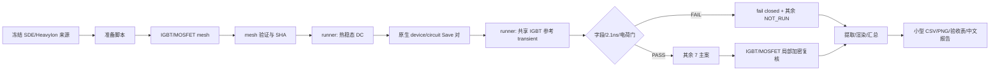

# 02 架构文档

上级：[01-需求文档](01-需求文档.md)  
下级：[modules/01-输入冻结与网格](modules/01-输入冻结与网格.md)、[modules/02-热稳态与瞬态](modules/02-热稳态与瞬态.md)、[modules/03-提取渲染与报告](modules/03-提取渲染与报告.md)  
依赖：[case_matrix.csv](case_matrix.csv)

## 目录与职责

```text
docs/changes/2026-07-14-igbt-mosfet-seb-paper-simulation/
  case_matrix.csv            唯一主案矩阵
  data/ figures/             小型发布数据与图
  01..09 文档                需求、架构、追踪、字典、验收、交接、报告
local_runtime/tcad_projects/igbt_mosfet_seb_paper_20260714/
  inputs/ mesh/ dc/ transient/ extracted/ rendered/ logs/
/home/tcad/codex_runs/igbt_mosfet_seb_paper_20260714/
  <runner-isolated-run-id>/   VM 原始运行
scripts/
  prepare_igbt_mosfet_seb_campaign.py
  extract_igbt_mosfet_seb_2ns.py
  render_igbt_mosfet_seb_fields.py
  summarize_igbt_mosfet_seb_campaign.py
  run_igbt_seb_case.ps1      唯一 SDevice 入口
```

## 数据流



## 输入派生约束

- IGBT SDE 与冻结源逐项同义；只允许重命名输出前缀。
- MOSFET 只做三项语义变化：`Collector→Drain`、collector 掺杂物种 `Boron→Arsenic`、相应 profile/placement 标识改名；位置、深度 0.5 µm、峰值 5e19 cm^-3、背景 n-buffer、全部网格规则保持一致。
- 加密变体只改变轨迹核心局部网格一级；其余 deck 归一化哈希必须一致。

## SDevice 两阶段协议

### 热稳态

- `Thermodynamic`、`Poisson Electron Hole Temperature` 耦合；Thermode 与 `Physics Temperature` 均为案例 `T_init`；
- 从 0 V 准静态升至目标 VCE；
- 输出 pre Plot TDR，并以 `Save(FilePrefix=...)` 生成 `*_des.sav` + `*_circuit_des.sav`；
- 从 PLT/TDR提取实际 VCE、Ic、功率、Tmin/Tavg/Tmax、Tmax 坐标。

### 瞬态

- 通过 runner 的 restart 参数上传原生 Save 对；deck `Load` 固定父 restart 前缀；
- 92–108 ps 保存电荷审计快照；2.1 ns 为独立分段终点并立即 Plot，确保精确时刻存在；
- Plot 请求电子/空穴迁移率、场、温度、电子/空穴密度与电流、热源、冲击电离/雪崩、HeavyIon 生成；实际字段名以 SVisual清单为准。

## 门控与失败语义

- `PASS`：运行成功且该门全部满足；
- `FAIL`：已有证据明确不满足；
- `NOT_RUN_REFERENCE_GATE`：按计划因参考门失败停止，不是遗漏；
- `NOT_RUN_DEPENDENCY`：父 mesh/restart 未形成；
- `VALIDATION_ONLY`：smoke/网格变体，不进入 8 主案统计。

## 可复现与安全

- runner manifest 为调度和输入谱系事实源；case metadata 为物理事实源；提取 sidecar 记录实际字段、单位、哈希；PNG metadata 记录源 TDR、字段、时刻、ROI、色标、脚本与 SHA；
- 不覆盖 attempt；不回退工作区既有改动；不将原始大产物复制到 docs。