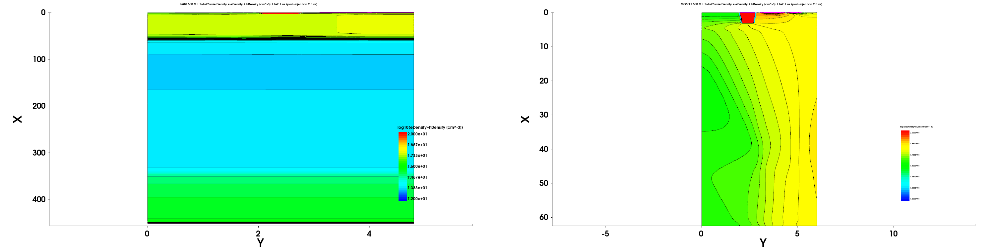
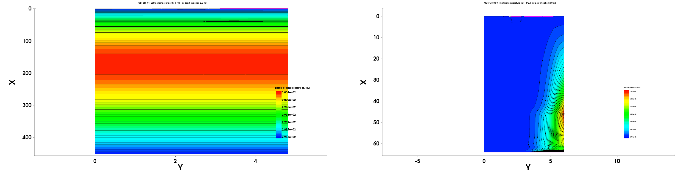
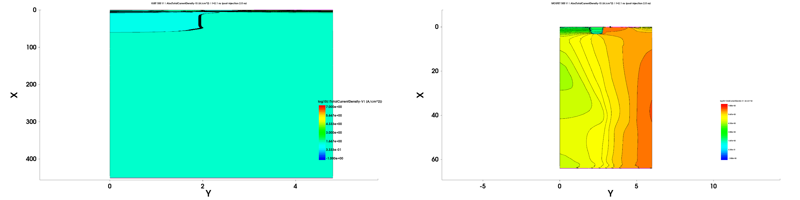

# 650 V IGBT / SJ MOSFET 重设计与偏压复核：正式仿真结果报告

## 结论状态（截至 2026-07-16）

650 V reference-model candidates 已冻结为：IGBT 少子寿命 `300 us`，MOSFET `attempt24 / SJ pillar scale=0.8`。二者都只是公开数据表目标下的二维参考模型，不是专有商用芯片结构复现。

baseline 实际静态证据已闭合：两器件的 BV、Vth、导通、650 V 漏电四门均 `PASSED`。refined-v1 两份实际 SDE 网格与 8 个静态 SDevice case 也已闭合；IGBT 四项 mesh consistency 通过，MOSFET refined-v1 的 Vth `4.01216156→3.89389811 V`、绝对差 `0.11826345 V` 超过 `0.1 V`，该 **FAILED 历史原样保留**。

随后只对 MOSFET active-region 网格做 refined-v2-local 加密，不改物理候选、全局/关断态 controls、SDevice 参数和预设阈值。四个 refined-v2-local 静态案全部成功，固定复用 baseline AreaFactor 后得到 BV `823.455702 V`、Vth `3.856898 V`、RDSon `0.0800596 Ω`、650 V 漏电 `7.6367213e-6 A`；Vth successive 差为 `0.03699976 V`，三级趋势估计剩余误差 `0.01684617 V`，其余三项 successive 差也均在不变阈值内。因此 MOSFET refined-v2-local 与组合 mesh consistency 门均 `PASSED`。

五个静态/网格门、关断场边界审计和两条非 seed 轨迹已全部闭合。随后签发 `data/heavy_ion_authorization.json`，其 SHA-256 为 `55a3a83a...b3c06`，精确绑定 77 个 DSL/mesh/static-run/field-run 文件记录；两份 DSL 现为 `heavy_ion_authorized=true`。授权范围仅允许在对应 325/400/500 V DC restart 哈希闭合后运行 LET15、2.1 ns 参考瞬态，不等于 SEB 安全或阈值结论。

六个 DC restart 已全部 PASS 并形成 SHA-256 `a5f0194b...e644e` 的 exact binding set。随后渲染并并发启动 6 个 LET15/2.1 ns 参考瞬态，但 IGBT 400 V 在 strike 前 `13.587637 ps` 因 LatticeTemperature 数值步长过小失败；因此当前最早未通过阶段为 Checkpoint E，已 fail closed，未发布 SEB、安全、阈值或正式 campaign 汇总结论。

在独立、仅数值诊断的 recovery attempt `IGBT400_PRESTRIKE_THERMAL_RECOVERY_V1_20260716B` 中，物理输入与 exact V400 parent 哈希全部保持不变，只改变时间步、非线性迭代/阻尼、分段、checkpoint 与输出。P0 的有限端量/温度样本推进到 `13.9850919 ps`，已越过原失败点，但未到 P0 的 `15 ps` 终点，且日志仍出现 `58` 次 LatticeTemperature update out of range；因此 recovery 状态为 `FAILED_NUMERICAL_ONLY`，P1/P2/P3 与正式 2.1 ns campaign extractor 均 `NOT RUN`。原失败 run/claim 与 recovery attempt 分开保留，两者都不是 SEB 证据。

本轮按范围变更取消当前 650 V IGBT 的新建 550 V 计划，状态为 `CANCELLED_BY_SCOPE_CHANGE`；未生成新 case、未启动 SDevice。只读复用历史 `IGBT_T298_V550_L15` 与当前 MOSFET V500 sibling run 完成 `COMPARISON_ONLY` 对照。MOSFET exact 2.1 ns TDR、PLT 和 16 个 audit TDR 已通过原 `scripts/extract_igbt_mosfet_seb_2ns.py` 的 SVisual headless 后处理，原 metadata/manifest 未改；这不改变全局 Checkpoint E 的 fail-closed 状态，也不支持 SEB PASS、阈值、安全电压或器件排名。

## 历史 IGBT 550 V vs 当前 MOSFET 500 V（COMPARISON_ONLY）

### 来源冻结与不可比条件

轻量冻结清单为 `data/igbt550_mosfet500_comparison_manifest.json`；并列结果为 `data/igbt550_mosfet500_comparison.json/csv`。当前绑定的关键 run 为：

- 历史 IGBT：`IGBT_T298_V550_L15__transient_reference_attempt01__20260715T064159391Z__27ebb6c0`；run manifest SHA-256 `906e3d83...5f89f0e`；历史 sidecar SHA-256 `22d05586...9dc0c`；exact 2.1 ns TDR SHA-256 `7e6acb8e...39c98`；PLT SHA-256 `9c8e8348...85406`。
- 当前 MOSFET DC parent：`MOSFET650_DC_RESTART_V500__authorized_55a3a83a_chain_v1__20260716T054548932Z__b7d96491`；manifest SHA-256 `8ef9ab43...fede`；restart main/circuit SHA-256 `235d91c5...abc10` / `3f35a68b...fcba5`。
- 当前 MOSFET transient：`MOSFET650_LET15_2P1NS_V500__authorized_55a3a83a_restart_a5f0194b_reference_v1__20260716T061943026Z__68883e0c`；manifest SHA-256 `583bbab4...a3ba`；mesh SHA-256 `1b900c26...0727`；exact 2.1 ns TDR SHA-256 `e4cf34dd...37f8`；PLT SHA-256 `4e89e3de...2ba2`。
- 当前授权/绑定/轨迹 SHA-256：`55a3a83a...b3c06` / `a5f0194b...e644e` / `880ca563...12e7e`。

该并列严格标记：

- `NOT_COMMON_BIAS`：历史 IGBT 为 VCE=550 V，当前 MOSFET 为 VDS=500 V。
- `NOT_SAME_STRUCTURE`：历史 451.15 µm IGBT 参考结构与当前 650 V SJ MOSFET reference model 不同。
- `NOT_SAME_TRACK`：IGBT `Start=(0,3.5) µm, Length=50 µm`；MOSFET `Start=(3.2,5.99) µm, Length=60.79 µm`。
- `AREA_FACTOR_2D_SEMANTICS_MISMATCH`：历史瞬态 sidecar 只有原生二维 `A/µm、pC/µm、J/µm`，没有绑定芯片 AreaFactor；当前 MOSFET 静态校准虽有 `5.3502886182e7 µm` effective out-of-plane width，本次瞬态提取没有应用该因子，仍是原生二维 per-µm 口径。两边 HeavyIon charge closure 的 1 µm 出平面假设也不是共同芯片面积归一化。
- `NOT_COMMON_GATE_CONTEXT`：历史 sidecar 的 PASS 只属于历史 campaign；当前 MOSFET runner `SUCCEEDED` 仍处于全局 Checkpoint E 失败背景，不能写成 SEB PASS。

### 只读 SVisual 提取结果

SVisual provenance 位于 `local_runtime/tcad_projects/igbt_mosfet_650v_seb_20260715/comparison_only_igbt550_mosfet500_20260716/`：exit code `0`，stdout/stderr 已保留；原 extractor SHA-256 `7ad58b7e...0523`。MOSFET comparison-only extraction JSON/field CSV SHA-256 分别为 `06a2a5d8...7ef9` / `75b6b444...59da`。所有 16 个 audit TDR、exact TDR、PLT 与 required fields 均存在且有限，PLT 精确到 `2.1 ns`，HeavyIon charge closure 误差 `0.0234846%`。extractor 内部门为 PASS 仅表示这些只读证据完整，发布状态仍为 `COMPARISON_ONLY`。

| 指标 | 历史 IGBT 550 V | 当前 MOSFET 500 V | 证据状态 |
|---|---:|---:|---|
| Tmax @ 2.1 ns | 300.386550 K | 703.289278 K | 各自内部 `EXTRACTED`；禁止跨器件优势解释 |
| 热点 (x,y) | (170.757233, 0) µm | (46, 6) µm | 坐标已提取；MOSFET region/interface 分类为 `UNEXTRACTED` |
| baseline terminal current | 5.63994e-8 A/µm | 8.54807e-14 A/µm | 原生 2D per-µm |
| final / peak terminal current | `UNEXTRACTED` | 0.0399006856 / 0.0399006856 A/µm @ 2.1 ns | 历史 sidecar 无该字段，不补造 |
| terminal collected charge | 0.00156671711 pC/µm | 60.1818755 pC/µm | 原生 2D per-µm；不计算比值 |
| terminal energy | 9.26832618e-13 J/µm | 3.00909377e-8 J/µm | 原生 2D per-µm；不计算比值 |
| full-Silicon Emax @ 2.1 ns | 1.45841604e5 V/cm | 6.95104217e5 V/cm | 各自内部场极值；MOSFET 最大值为边界坐标 (0,4.40625) µm |
| HeavyIon nominal / integrated charge | 7.775 / 8.06732130 pC | 9.452845 / 9.45506496 pC | 轨迹长度不同；分别 closure |
| HeavyIon closure error | 3.7597595% | 0.0234846% | 16/16 audit 完整 |

因此唯一允许的结论是：两套既有证据可在明确非共同工况的前提下分栏展示。**不计算跨器件性能比例，不声称 500 V MOSFET 优于或劣于 550 V IGBT，不给出 SEB 阈值、安全电压或安全排名。**

### 2.1 ns SVisual 空间场左右对照（COMPARISON_ONLY）

以下三图由 VM 上的 Sentaurus Visual W-2024.09 以 `svisual -bx -python` 直接读取两个已绑定的 exact 2.1 ns TDR 并导出左右面板；发布图只做无损左右拼接，没有用 CSV、手工插值或重画空间场，也没有启动 SDevice。图内与图注均明确为 **IGBT 550 V**（左）、**MOSFET 500 V**（右）、**t=2.1 ns (post-injection 2.0 ns)**。



**图 1 — 总载流子密度。** 实际物理量定义为 `TotalCarrierDensity = eDensity + hDensity`，单位 `cm^-3`；SVisual 显示 `log10(eDensity+hDensity)`，左右共同色标 `12..20`。高值均位于各自坐标的 `x≈0` 一端；IGBT 峰值 `6.98499642314e19 cm^-3 @ (0, 3.356250) µm`，MOSFET 峰值 `8.69851376267e19 cm^-3 @ (0.0625, 3.65625) µm`。坐标只用于各自结构内部定位，不计算跨器件峰值比。



**图 2 — 晶格温度。** 实际字段为 `LatticeTemperature [K]`。IGBT 热点为 `300.386549973 K @ (170.757233, 0) µm`，位于 `y=0` 边界附近；MOSFET 热点为 `703.289277824 K @ (46, 6) µm`，位于 `y=6` 边界附近。两案动态范围相差过大，因此 IGBT 使用 `298.15..300.40 K`、MOSFET 使用 `298.15..703.30 K` 的独立面板色标；**不能按颜色直接跨面板判优**。



**图 3 — 电流密度。** TDR 实际字段为 `Abs(TotalCurrentDensity-V) [A/cm^2]`，SVisual 显示 `log10(Abs(TotalCurrentDensity-V))`，左右共同色标 `-1..7`。高值均集中在各自坐标的 `x≈0` 一端；IGBT 峰值 `6.29189199357e5 A/cm^2 @ (0.802219, 2.796587) µm`，MOSFET 峰值 `3.33508399778e6 A/cm^2 @ (0, 3.28125) µm`。

图像与字段 provenance：`data/igbt550_mosfet500_svisual_spatial_comparison.json`（SHA-256 `a8c5fbb5...f30385`）；两源 TDR SHA-256 分别为 IGBT `7e6acb8e...39c98`、MOSFET `e4cf34dd...37f8`，本轮 VM 端重新核对一致。载流子/温度/电流密度发布图 SHA-256 分别为 `b5605f62...39d8d1` / `644006e0...6e34a` / `41bc7b92...2f234`。

这些空间场只支持图上可见的分布区域、边界热点与峰值坐标描述。IGBT 与 MOSFET 的偏压、结构尺度（历史 IGBT `451.15 µm`、SJ MOSFET `64 µm`）、HeavyIon 轨迹和二维归一化均不同；禁止据此给出 SEB 安全、阈值、电压排名或商用性能结论。

### 全局 gate 未改变

本轮没有运行正式 campaign summary，也没有改写原 transient/campaign gate。收口复核锚点保持：`campaign_run_summary.json` SHA-256 `ce06d76c...2cc9`、CSV `864077be...85a9`；IGBT 400 V 原失败 manifest `0ca326d5...d8109`；recovery V1 轻量证据 `36e7d14c...a3cc`。全局状态仍为 `FAILED_NUMERICAL_PRESTRIKE_IGBT400`，recovery 仍为 `FAILED_NUMERICAL_ONLY`。`local_runtime/.../comparison_only_igbt550_mosfet500_20260716/validation_result.json` 已通过 5 份 JSON、2 行 CSV、72 个路径/哈希绑定和 Python compile 检查，并确认原失败/recovery claim 文本未改。

## 模型来源与边界

- IGBT 目标：STMicroelectronics `STGWA40HP65FB2`，650 V trench-gate field-stop、40 A class。
- MOSFET 目标：Infineon `IPDQ65R099CFD7`，650 V、RDS(on) max 99 mΩ、VGS(th) 3.5–4.5 V。
- W-2024.09 私有学习种子及复制树哈希见 `projects/igbt_mosfet_650v_seb_20260715/seed_provenance.json`；Synopsys 原文件和大体积仿真产物只保留在 `local_runtime/`。
- 冻结、静态门、mesh contract 和 provenance 指针见两份 DSL：`projects/igbt_mosfet_650v_seb_20260715/devices/igbt_650v.json`、`mosfet_650v_sj.json`。

## baseline 静态结果

提取证据：`data/static_baseline_extraction.json`；汇总：`data/static_baseline_gate_summary.csv`。

| 器件 | baseline mesh SHA-256 | BV（首个原始 1e-6 A/µm 样本） | Vth | 导通 | 650 V 漏电 | 四门 |
|---|---|---:|---:|---:|---:|---|
| IGBT | `535bef9cfb45...e1664` | 707.497688 V | 6.448419 V | VCEsat 1.550000 V | 1.9422196e-5 A | PASSED |
| MOSFET | `fa8279e907be...e569` | 824.279280 V | 4.012162 V | RDSon 0.087000 Ω | 7.3603472e-6 A | PASSED |

BV 始终按高端端子 `InnerVoltage` 的首个**原始**样本满足 `abs(eCurrent+hCurrent) >= 1e-6 A/um` 提取；solver failure 没有被当作 BV。

## refined mesh contract 与比较

两份 DSL 在运行前固定了同一契约：物理候选、SDevice deck 和参数保持不变，只把 global/active mesh 尺寸减半，并将界面 `hlocal` 从 `0.003 um` 减为 `0.0015 um`、offset maxlevel 从 6 增为 7。阈值为 BV 相对差 ≤2%、Vth 绝对差 ≤0.1 V、导通相对差 ≤5%、漏电相对差 ≤10%；缺证据或非有限数值 fail closed。

实际新网格：

| 器件 | mesh generation ID | refined mesh SHA-256 | points / elements |
|---|---|---|---:|
| IGBT | `IGBT650_REFINED_MESH__20260715T232427143Z` | `84d24e1dc140...fd755` | 9152 / 17836 |
| MOSFET | `MOSFET650_REFINED_MESH__20260715T232519123Z` | `949901b1790b...9b4ad` | 8303 / 16250 |

refined 提取固定复用 baseline AreaFactor：IGBT `5.2755946328e7 um`、MOSFET `5.3502886182e7 um`。refined 自校准诊断因子分别为 `4.7135269384e7 um` 与 `4.1197619373e7 um`，没有用于替换固定因子或掩盖差异。

| 器件 | 指标 | baseline | refined | 差值定义 | 差值 | 限值 | 结果 |
|---|---|---:|---:|---|---:|---:|---|
| IGBT | BV | 707.497688 V | 707.789946 V | relative | 0.04131% | 2% | PASS |
| IGBT | Vth | 6.448419 V | 6.450388 V | absolute | 0.001969 V | 0.1 V | PASS |
| IGBT | VCEsat | 1.550000 V | 1.491603 V | relative | 3.7675% | 5% | PASS |
| IGBT | 650 V leakage | 1.9422196e-5 A | 1.9749524e-5 A | relative | 1.6853% | 10% | PASS |
| MOSFET | BV | 824.279280 V | 823.265338 V | relative | 0.12301% | 2% | PASS |
| MOSFET | Vth | 4.012162 V | 3.893898 V | absolute | **0.118263 V** | **0.1 V** | **FAIL** |
| MOSFET | RDSon | 0.087000 Ω | 0.083025 Ω | relative | 4.5695% | 5% | PASS |
| MOSFET | 650 V leakage | 7.3603472e-6 A | 7.6404080e-6 A | relative | 3.8050% | 10% | PASS |

完整、可复算的 refined-v1 失败历史：`data/static_refined_extraction.json`、`data/static_refined_gate_summary.csv`、`data/static_mesh_consistency.json`、`data/static_mesh_consistency.csv`。

## MOSFET refined-v2-local 三级趋势闭合

refined-v2-local 保留 refined-v1 的 global/off-state controls，只将 active-region spacing 从 `[0.2, 0.1, 0.01, 0.01] um` 减半到 `[0.1, 0.05, 0.005, 0.005] um`。三级网格点数/单元数为 `3610/7008 → 8303/16250 → 19073/37648`，三个 mesh SHA-256 互异且由 mesh-generation manifest 绑定。

固定 baseline AreaFactor 始终为 `5.3502886182e7 um`；refined-v1/refined-v2 自校准诊断因子分别为 `4.1197619373e7` 与 `3.4462188850e7 um`，均未参与门判定。

| 指标 | baseline | refined-v1 | refined-v2-local | v1→v2 差 | 限值 | 结果 |
|---|---:|---:|---:|---:|---:|---|
| BV | 824.279280 V | 823.265338 V | 823.455702 V | 0.023123% | 2% | PASS |
| Vth | 4.012162 V | 3.893898 V | 3.856898 V | 0.0369998 V | 0.1 V | PASS |
| RDSon | 0.087000 Ω | 0.0830245 Ω | 0.0800596 Ω | 3.57121% | 5% | PASS |
| 650 V leakage | 7.3603472e-6 A | 7.6404080e-6 A | 7.6367213e-6 A | 0.0482533% | 10% | PASS |

Vth 还满足收缩三级趋势：step contraction ratio `0.312859`、observed order `1.67642`、外推极限 `3.840052 V`、估计 refined-v2 剩余误差 `0.0168462 V`。证据见 `data/static_refined_v2_local_extraction.json`、`data/static_refined_v2_local_gate_summary.csv`、`data/static_mesh_consistency_v2.json/csv`。

## 关断场定位与非 seed 轨迹冻结

复用了 6 个既有 325/400/500 V verified-mesh field runs/TDR，没有重复启动 SDevice。每个 PLT 的末端高端电压均精确为目标偏压，run manifests 全部为 `AUTO_LEASE`、`Threads=1`、lease acquired/released、affinity `VERIFIED`，实际 cores 为 IGBT `6/2/3`、MOSFET `4/7/5`。

全域 Silicon `Emax` 位于 x=0 接触/顶表面边界且随偏压不变，因此只保留为边界背景。敏感区改以随偏压增长的 `ImpactIonization` 最大值定位，并在严格硅内 cutline 上独立复核轨迹 Emax：

- IGBT 500 V：ImpactIonization 最大值 `2.350493e15 cm^-3 s^-1` @ `(3.219007, 2.148823) um`，距 Si/Oxide tip segment `0.009007 um`；冻结 `StartPoint=(3.22, 2.14882278442) um`、`Direction=(1,0)`、`Length=70.77 um`，轨迹 Emax `1.998389e5 V/cm`。
- MOSFET 500 V：ImpactIonization 最大值 `1.975665e16 cm^-3 s^-1` @ `(62.5, 6.0) um`，距 SJ P-pillar termination reference `1.2 um`、背面 Si 边界 `1.5 um`；按 `0.01 um` 严格硅内裕量冻结 `StartPoint=(3.20, 5.99) um`、`Direction=(1,0)`、`Length=60.79 um`，轨迹 Emax `1.883717e5 V/cm`。

两条轨迹均明确 `seed_track_reused=false`。轻量哈希证据为 `data/field_track_localization_v2.json/csv`，详细边界距离与全部 run/deck/mesh/TDR/extraction hashes 见 `电场与入射轨迹定位报告.md`；此阶段未运行 HeavyIon。

## 精确绑定授权与 restart/transient 门控

`heavy_ion_authorization.json` 仅在 baseline 四门、IGBT refined-v1、MOSFET refined-v2-local 和两条冻结轨迹逐项复核后生成。它绑定当前 IGBT/MOSFET DSL hashes、baseline/refined/refined-v2 mesh hashes、20 个静态 run manifests/PLT、6 个 field run manifests/PLT/TDR/extractions，共 `77` 个文件记录；prepare 会重新校验每个路径、大小和 SHA-256，任一不匹配即阻断。

`prepare_igbt_mosfet_650v_campaign.py --include-post-static-cases` 先通过精确授权检查并在 immutable 目录 `post_static_inputs/authorization_55a3a83abba3a9d7/` 渲染 6 个 DC restart 输入。六案闭合后，`data/restart_binding_set.json`（SHA-256 `a5f0194b...e644e`）逐案绑定 PASS gate、parent run manifest、native main/circuit restart、实际偏压和 mesh hash；prepare 再校验这些文件后，才在新目录 `post_static_inputs/authorization_55a3a83abba3a9d7__restart_a5f0194b3c15cefd/` 渲染 6 个 transient。每份 transient deck 实际包含 `Load(FilePrefix="<DEVICE>650_V<BIAS>_restart")`，metadata 同时绑定 parent restart IDs/hashes，禁止用重新偏压扫描冒充 restart 链。

瞬态输入还修正了物理单位：LET15 使用 `LET_f=0.1555 pC/um`，不是在 `PicoCoulomb` 模式下误写 `LET=15`；并生成 16 个 92–108 ps strike-window charge-audit TDR、pre-strike TDR 和精确 2.1 ns TDR 契约。该渲染成功只代表输入与 parent 闭合，不代表瞬态运行通过。

## 325/400/500 V DC restart 链

两器件各自严格按 325→400→500 V 推进，前一级 `restart_gate.json` 明确 PASS 后才启动后一级。六案均实际达到目标偏压，native restart pair 与 prebias TDR 齐全；全部为 `AUTO_LEASE`、`Threads=1`、lease acquired/released、affinity `VERIFIED`、exit code 0。

| 器件 | 偏压 | run ID | 高端电流 (A/um) | Tmax (K) | core / wall time | gate |
|---|---:|---|---:|---:|---|---|
| IGBT | 325 V | `IGBT650_DC_RESTART_V325__authorized_55a3a83a_chain_v1__20260716T044246750Z__9b5c35ba` | 1.009e-12 | 298.15 | 3 / 508 s | PASS |
| IGBT | 400 V | `IGBT650_DC_RESTART_V400__authorized_55a3a83a_chain_v1__20260716T045835700Z__80fe2d4a` | 1.352e-12 | 298.15 | 3 / 519 s | PASS |
| IGBT | 500 V | `IGBT650_DC_RESTART_V500__authorized_55a3a83a_chain_v1__20260716T051213450Z__823ecaeb` | 2.239e-12 | 298.15 | 2 / 531 s | PASS |
| MOSFET | 325 V | `MOSFET650_DC_RESTART_V325__authorized_55a3a83a_chain_v1__20260716T044246880Z__ae6e93ca` | 7.826e-14 | 298.1500002 | 2 / 1651 s | PASS |
| MOSFET | 400 V | `MOSFET650_DC_RESTART_V400__authorized_55a3a83a_chain_v1__20260716T051513983Z__de8a5603` | 8.199e-14 | 298.1500003 | 3 / 1666 s | PASS |
| MOSFET | 500 V | `MOSFET650_DC_RESTART_V500__authorized_55a3a83a_chain_v1__20260716T054548932Z__b7d96491` | 9.068e-14 | 298.1500004 | 2 / 1575 s | PASS |

## LET15 / 2.1 ns 阶段门失败

六个 exact-parent transient 在输入独立后按 cores 2–7、每案单线程 lease 并发启动；同一时刻另有 unmanaged `sdevice` 固定在 core 1，allocator 已动态避开。IGBT 400 V 案 `IGBT650_LET15_2P1NS_V400__authorized_55a3a83a_restart_a5f0194b_reference_v1__20260716T061941348Z__452be836` 于 `13.587637 ps` 结束，显著早于 `100 ps` strike。日志显示 LatticeTemperature 方程反复出现 solution/update out of range，步长缩减至过小后 exit code 2；末端仍为 400 V、`1.957406e-12 A/um`、Tmax `298.150006 K`。

因此这是 **pre-strike 数值失败**，不是 HeavyIon 响应、SEB、热失控或安全证据。Checkpoint E 对原 attempt 保持 fail closed：不在原 run ID 下重试、不绕过、不进入正式 campaign 汇总/SEB 判据。其余五案均在该失败被观察前作为独立 sibling 启动，最终 runner 为 `SUCCEEDED` 且各自保存 exact 2.1 ns TDR（IGBT 325/500 V、MOSFET 325/400/500 V）。阶段关闭时未做正式 campaign 场/电荷提取；本轮只对 MOSFET 500 V sibling 做 `COMPARISON_ONLY` SVisual 后处理，该动作不能改变整个阶段的 FAIL 状态。

## IGBT 400 V pre-strike 热方程 recovery（独立数值诊断）

- recovery attempt：`IGBT400_PRESTRIKE_THERMAL_RECOVERY_V1_20260716B`；profile：`IGBT400_PRESTRIKE_THERMAL_DAMPED_SEGMENTED_V1`；scope：`NUMERICAL_DIAGNOSTIC_ONLY`。
- 原失败 run、原 claim 与五个 sibling 证据均未改写。原失败 manifest/deck SHA-256 复核后仍为 `0ca326d5...d8109` / `ffbeacca...5c324`。
- exact parent 仍为 `IGBT650_DC_RESTART_V400__authorized_55a3a83a_chain_v1__20260716T045835700Z__80fe2d4a`；main/circuit restart、mesh、authorization、binding、`sdevice.par` SHA-256 分别保持 `401882ef...ac146`、`3f35a68b...fcba5`、`84d24e1d...fd755`、`55a3a83a...b3c06`、`a5f0194b...e644e`、`6aa6b189...5f859`。HeavyIon canonical block、400 V bias、材料物理、热边界、LET15、track、100 ps injection 与全链 2.1 ns 终点契约不变，`physics_delta=[]`。
- P0 数值变化仅含 BE 时间步细化、`Iterations 30→100`、`Notdamped 50→0`、12–15 ps 邻域 `LineSearchDamping=0.5`、分段与 checkpoint/output；保持 `Poisson Electron Hole Temperature` 全耦合。
- 实际 P0 run ID：`IGBT650_V400_RECOVERY_P0__authorized_55a3a83a_restart_a5f0194b_thermal_v1__20260716T080339800Z__f9e3018b`。调度为 `AUTO_LEASE`、core `2`、`Threads=1`、lease acquired/released=`true`、affinity `VERIFIED`；wall time `1301 s`。运行前后 lease count 均为 0；既有 unmanaged SDevice PID 12620/core 1 未触碰，allocator 自动避开。
- P0 最后接受点为 `13.9850918989 ps`，已越过原 `13.587637 ps`，Collector=`400 V`、`3.16919994e-12 A/um`、Tmax=`298.15000646 K`，PLT 783 个样本均有限。越过原失败点后的首次 LatticeTemperature out-of-range 尝试区间为 `13.820→13.835 ps`，最后一次记录在约 `13.985 ps`；P0 未达到 `15 ps`，步长最低缩至 `5.5644e-18 s`，日志累计 `58` 次 `Solution/update out of range for variable LatticeTemperature`。门条件已经失败且推进呈渐近停滞，故 fail-closed 中断，runner exit code `130`；未写出 15 ps TDR 或 checkpoint。
- 阶段状态：P0=`FAILED_NUMERICAL_ONLY`；P1/P2/P3=`NOT RUN`；正式 campaign 2.1 ns extractor=`NOT RUN`；正式 campaign 汇总=`NOT RUN`。另行完成的 MOSFET V500 `COMPARISON_ONLY` 提取不属于 recovery 链，也不支持 SEB、热失控、安全或阈值结论。
- 轻量证据：`data/igbt_400v_prestrike_recovery.json`（SHA-256 `36e7d14c...a3cc`）；大日志、PLT、actual inputs 与 run manifest 只保留在 `local_runtime/tcad_projects/igbt_mosfet_650v_seb_20260715/recovery/IGBT400_PRESTRIKE_THERMAL_RECOVERY_V1_20260716B/`。

## 8 个 refined SDevice runs 与租约证据

全部为 `PARALLEL_EXPLORATORY`、`AUTO_LEASE`、`sdevice --threads 1`；每个 manifest 均记录 `lease_acquired=true`、`lease_released=true`、`affinity_verification=VERIFIED`、`exit_code=0`。两批各使用 cores 1–4，没有显式指定 `CpuCore`，也没有禁用 lease。

| case | run ID | core | wall time |
|---|---|---:|---:|
| IGBT BV | `IGBT650_REFINED_STATIC_BV__mesh_consistency_v1__20260715T232824034Z__34617479` | 1 | 316 s |
| IGBT Vth | `IGBT650_REFINED_STATIC_VTH__mesh_consistency_v1__20260715T232824035Z__bfc09029` | 3 | 178 s |
| IGBT conduction | `IGBT650_REFINED_STATIC_CONDUCTION__mesh_consistency_v1__20260715T232824124Z__62e59e82` | 2 | 244 s |
| IGBT leakage | `IGBT650_REFINED_STATIC_OFF_LEAKAGE__mesh_consistency_v1__20260715T232824343Z__8d506c70` | 4 | 369 s |
| MOSFET BV | `MOSFET650_REFINED_STATIC_BV__mesh_consistency_v1__20260715T233541084Z__3c4de328` | 2 | 459 s |
| MOSFET Vth | `MOSFET650_REFINED_STATIC_VTH__mesh_consistency_v1__20260715T233541134Z__d4b3156d` | 1 | 158 s |
| MOSFET conduction | `MOSFET650_REFINED_STATIC_CONDUCTION__mesh_consistency_v1__20260715T233541444Z__ec55d1f2` | 3 | 188 s |
| MOSFET leakage | `MOSFET650_REFINED_STATIC_OFF_LEAKAGE__mesh_consistency_v1__20260715T233541605Z__531e88c6` | 4 | 408 s |

运行前 fresh probe 观察到 `sde`、`sdevice`、`swb` 均来自 W-2024.09，license server 与 `snpslmd` 均 UP，未执行 license recovery。私有 mesh generation manifest、refined run-set、原始 PLT/log/stdout 和 runner manifests 位于 `local_runtime/tcad_projects/igbt_mosfet_650v_seb_20260715/`。

## 主张账本与历史 provenance 缺口

轻量主张账本为 `data/claim_ledger.json`。它区分已支持主张、失败门和未解决历史缺口。

IGBT `igbt_seed_attempt15_drift_thickness_74/attempt_manifest.json` 仍写 `PREPARED/PENDING_SDE`。审计进一步确认：该 attempt 目录当前 mesh SHA-256 为 `96a8026a...dde8`，而 baseline runs 实际绑定 `535bef9c...e1664`。缺少把后者追溯为 attempt15 那次 SDE 直接输出的证据，因此没有伪造 `SDE_SUCCEEDED`；该历史链路明确保留为 `UNRESOLVED_HISTORICAL_GAP`。

## post-static campaign 计数范围

`data/campaign_run_summary.json/csv` 的旧 `run_count=0` 是启动 post-static 之前的快照，现已被 6 个 restart、本轮 transient manifests 与独立 P0 recovery 证据取代。由于 Checkpoint E 与 P0 recovery 均失败，未运行正式 campaign 汇总脚本来发布可能误导的“完成态”汇总；当前正式轻量证据以 `restart_binding_set.json`、各 run `restart_gate.json`、原失败 transient manifest/log、`igbt_400v_prestrike_recovery.json` 和 `claim_ledger.json` 为准。

## 最小复算命令

```powershell
python scripts\prepare_igbt_mosfet_650v_campaign.py --validate-only
python scripts\extract_igbt_mosfet_650v_static.py --run-set local_runtime\tcad_projects\igbt_mosfet_650v_seb_20260715\static_run_sets\baseline_candidates_igbt300us_mosfet_attempt24.json
python scripts\extract_igbt_mosfet_650v_static.py --run-set local_runtime\tcad_projects\igbt_mosfet_650v_seb_20260715\static_run_sets\refined_mesh_consistency_v1.json
python scripts\compare_igbt_mosfet_650v_static_mesh.py
python scripts\extract_igbt_mosfet_650v_static.py --run-set local_runtime\tcad_projects\igbt_mosfet_650v_seb_20260715\static_run_sets\refined_mesh_consistency_v2_local.json --device-family MOSFET --output-stem static_refined_v2_local
python scripts\compare_mosfet_650v_mesh_v2.py
python scripts\authorize_igbt_mosfet_650v_heavyion.py
python scripts\prepare_igbt_mosfet_650v_campaign.py --include-post-static-cases
python scripts\extract_igbt_mosfet_650v_restart.py --build-binding-set
python scripts\prepare_igbt_mosfet_650v_campaign.py --include-post-static-cases --restart-bindings docs\changes\2026-07-15-igbt-mosfet-650v-redesign\data\restart_binding_set.json
python scripts\manage_igbt_400v_prestrike_recovery.py verify --attempt-root local_runtime\tcad_projects\igbt_mosfet_650v_seb_20260715\recovery\IGBT400_PRESTRIKE_THERMAL_RECOVERY_V1_20260716B
```

Checkpoint E 原失败与独立 P0 recovery 均保持 fail closed；不得运行 P1/P2/P3、正式 campaign 2.1 ns extractor 或正式 campaign 汇总来绕过该失败。本轮已完成的 MOSFET V500 SVisual 后处理仅为 `COMPARISON_ONLY`，不改变上述限制。

## 当前门状态与阻塞

- baseline static：`PASSED`（IGBT、MOSFET）。
- refined static datasheet gates：`PASSED`（IGBT、MOSFET）。
- IGBT mesh consistency：`PASSED`（refined-v1）。
- MOSFET refined-v1：`FAILED_HISTORY_RETAINED`（Vth 绝对差 0.118263 V）。
- MOSFET mesh consistency：`PASSED`（refined-v2-local；successive Vth 差 0.0369998 V，估计剩余误差 0.0168462 V）。
- combined mesh consistency：`PASSED`。
- field localization / track freeze：`PASSED`（两条 track 均 `VERIFIED_FROZEN_NOT_SEED`）。
- post-static authorization：`AUTHORIZED`，证据 SHA-256 `55a3a83a...b3c06`。
- HeavyIon authorization：`true`，但仅对精确 restart 链后的 LET15、2.1 ns 参考瞬态生效。
- 325/400/500 V DC restart：`PASSED`（IGBT、MOSFET 各自严格 325→400→500 V；6/6 exact bias/native restart/scheduler gates）。
- restart binding / transient rendering：`PASSED`（binding SHA-256 `a5f0194b...e644e`；6 份 deck 均 Load exact parent，LET15=`LET_f=0.1555 pC/um`）。
- LET15 transient：`FAILED`（原 IGBT 400 V run 在 13.587637 ps、strike 前因 LatticeTemperature 数值步长过小退出；不是 SEB/安全证据）。
- IGBT 400 V recovery P0：`FAILED_NUMERICAL_ONLY`（推进到 13.9850919 ps，端量/Tmax 有限但仍有 LatticeTemperature out-of-range，未达 15 ps）；P1/P2/P3=`NOT RUN`。
- 当前 650 V IGBT 新建 550 V 计划：`CANCELLED_BY_SCOPE_CHANGE`（未生成 case，未启动 SDevice）。
- 历史 IGBT 550 V：`HISTORICAL_REFERENCE_SUPPORTED`（仅历史工况内部证据）。
- MOSFET V500 SVisual 后处理：`COMPARISON_ONLY`（exact 2.1 ns TDR/PLT/16 audit 已提取；runner SUCCEEDED 不是 SEB PASS）。
- 正式 campaign 2.1 ns extractor：`NOT RUN`（仅 P3 完整门通过后允许；comparison-only 单案后处理不改变该状态）。
- 历史 IGBT 550 V vs MOSFET 500 V：`COMPARISON_ONLY_NON_COMMON_CONDITIONS`（不计算性能比、不做阈值或安全排名）。
- 轻量 campaign 汇总：`NOT RUN`（Checkpoint E/P0 recovery 失败后停止，旧 run_count=0 仅为历史快照）。
- 当前阻塞：停在 recovery P0；原失败与 recovery attempt 独立保留，不得进入 P1+、SEB 阈值、安全或热失控主张。