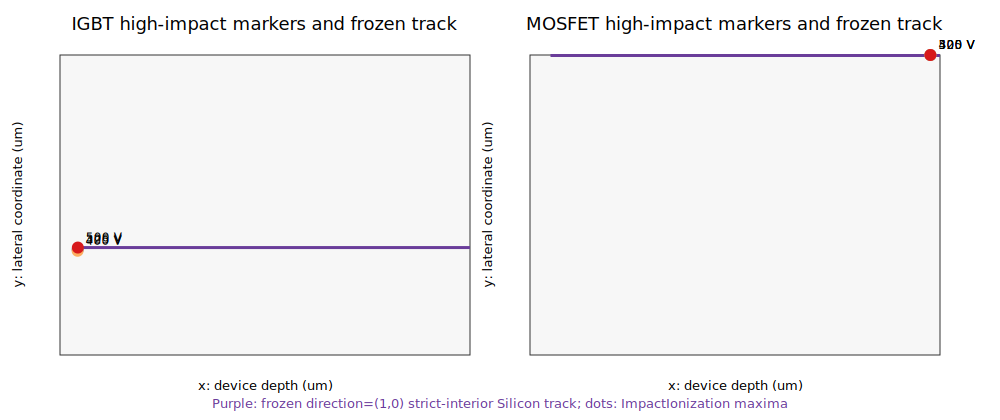

# 650 V IGBT / MOSFET 关断电场与入射轨迹定位

状态：`VERIFIED_TRACKS_FROZEN_HEAVYION_NOT_AUTHORIZED`。六份已有 325/400/500 V TDR 被复用，没有重复 SDevice 仿真；v1 边界最大值记录保留，v2 轻量证据见 `data/field_track_localization_v2.json/csv`。此证据本身仍不授权 HeavyIon。

全域 Silicon `Emax` 位于 x=0 接触/顶表面边界且随偏压不变，因此只保留为边界背景，不用于选轨。敏感区由 `ImpactIonization` 最大值定位，冻结轨迹上的 `Emax` 另行用严格硅内 cutline 复核。

| 器件 | 偏压/实际偏压 (V) | 全域 Emax (V/cm) @ (x,y) um | ImpactIonization max @ (x,y) um | 轨迹 Emax (V/cm) | run ID | core |
|---|---:|---|---|---:|---|---:|
| IGBT | 325 / 325.000000 | 3.343922e+05 @ (0.000000, 4.406250) | 3.219819e+14 @ (3.194939, 2.109637) | 1.505423e+05 | `IGBT650_FIELD_V325__checkpoint_b_field_localization_v1__20260716T032752310Z__175339f3` | 6 |
| IGBT | 400 / 400.000000 | 3.343922e+05 @ (0.000000, 4.406250) | 9.584924e+14 @ (3.176266, 2.084636) | 1.547242e+05 | `IGBT650_FIELD_V400__checkpoint_b_field_localization_v1__20260716T032752495Z__caf7ff27` | 2 |
| IGBT | 500 / 500.000000 | 3.343922e+05 @ (0.000000, 4.406250) | 2.350493e+15 @ (3.219007, 2.148823) | 1.998389e+05 | `IGBT650_FIELD_V500__checkpoint_b_field_localization_v1__20260716T032753086Z__e4556c29` | 3 |
| MOSFET | 325 / 325.000000 | 6.440527e+05 @ (0.000000, 4.400391) | 3.689419e+15 @ (62.500000, 6.000000) | 1.551730e+05 | `MOSFET650_FIELD_V325__checkpoint_b_field_localization_v1__20260716T032753704Z__e87609e8` | 4 |
| MOSFET | 400 / 400.000000 | 6.440527e+05 @ (0.000000, 4.400391) | 8.334669e+15 @ (62.500000, 6.000000) | 1.701390e+05 | `MOSFET650_FIELD_V400__checkpoint_b_field_localization_v1__20260716T032754473Z__e3db44a0` | 7 |
| MOSFET | 500 / 500.000000 | 6.440527e+05 @ (0.000000, 4.400391) | 1.975665e+16 @ (62.500000, 6.000000) | 1.883717e+05 | `MOSFET650_FIELD_V500__checkpoint_b_field_localization_v1__20260716T032755074Z__58d0108c` | 5 |

## 冻结轨迹

- IGBT: `trench oxide tip / P-body-to-drift high-impact-ionization region`；500 V ImpactIonization marker=(3.219007, 2.148823) um。
  - StartPoint=(3.220000, 2.148823), Direction=(1, 0), Length=70.770000 um，终点=(73.990000, 2.148823)；`seed_track_reused=false`。
  - 敏感标记到 Si/Oxide tip segment、命名结参考、背面 Si 边界、最近横向 Si 边界的距离分别为 0.009007 / 2.538571 / 70.780993 / 2.148823 um。
- MOSFET: `drain-side high-impact-ionization region adjacent to the SJ P-pillar termination`；500 V ImpactIonization marker=(62.500000, 6.000000) um。
  - StartPoint=(3.200000, 5.990000), Direction=(1, 0), Length=60.790000 um，终点=(63.990000, 5.990000)；`seed_track_reused=false`。
  - 敏感标记到 Si/Oxide tip segment、命名结参考、背面 Si 边界、最近横向 Si 边界的距离分别为 59.398432 / 1.200000 / 1.500000 / 0.000000 um。

轨迹由 500 V ImpactIonization 敏感标记的 y 坐标确定；若标记落在横向边界，按预先记录的 0.01 um 严格硅内裕量夹紧。深度方向从氧化层尖端之后 0.01 um 开始，在背面边界之前 0.01 um 结束。它们不是 DSL 中的 seed track，也没有在本阶段运行 HeavyIon。

