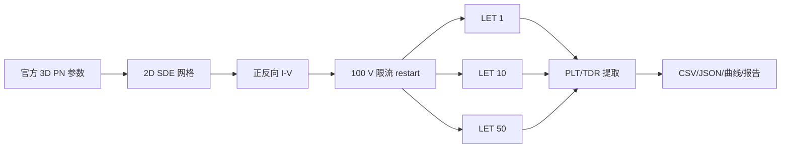

# 参数与仿真架构

## 官方参数源

来源：Sentaurus W-2024.09 Application Library `GettingStarted/sdevice/3Ddiode_demo`。

| 项目 | 二维模型取值 |
|---|---:|
| 硅区尺寸 | `10 × 1 µm` |
| 顶部掺杂 | Boron Gaussian，`PeakVal=1e18 cm^-3` |
| 底部掺杂 | Phosphorus Gaussian，`PeakVal=1e18 cm^-3` |
| 两侧 profile | `ValueAtDepth=1e10 cm^-3`，`Depth=8 µm`，`Factor=0.8` |
| 温度 | `300 K` |
| 反偏外加电压 | `-100 V`（top） |
| 反向串联电阻 | `1e7 Ω·µm`（官方示例设置） |
| 入射轨迹 | `(0, 0.5) → +x`，长度 `10 µm` |
| 注入时刻 | `100 ps` |
| 轨迹半径参数 | `Wt_hi=0.1 µm` |
| LET_f | `0.0103667/0.103667/0.518335 pC/µm` |

## 数据流

## 执行约束

- SDevice 统一通过 `scripts/run_igbt_seb_case.ps1` 的自动核心租约执行。
- 每个 case 使用 `--threads 1`；三个 LET case 在共享 restart 完成后并行。
- `92–108 ps` 保存密集 TDR 审计点；所有正式 case 观察到 `100 ns`。
- 原始 TDR、SAV 和日志保留在忽略目录 `local_runtime/pn_diode_heavy_ion/`。