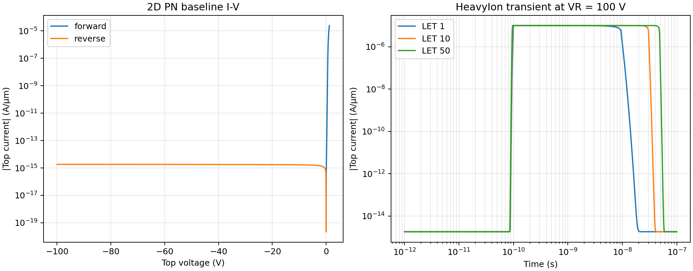

# 2026-07-21 日记｜把官方 PN 结改造成可审计的单粒子仿真

今天完成了一条从官方示例到单粒子瞬态结果的完整 TCAD 链路。

一开始的目标很直接：复制 Sentaurus 现有 PN 结模型，在此基础上加入 HeavyIon 注入，观察不同 LET 下的电学响应。真正落地后，工作重点并不只是“让 deck 跑起来”，而是保证二维投影、偏置网络、时间窗、并行调度和结果闭合都经得起复查。

## 今天完成的事情

我从 Sentaurus W-2024.09 的 `3Ddiode_demo` 提取了真实参数：顶部是 Boron Gaussian，底部是 Phosphorus Gaussian，峰值均为 `1e18 cm^-3`，在 `8 µm` 深度降到 `1e10 cm^-3`。随后把 `1 × 1 × 10 µm` 三维结构投影成 `10 × 1 µm` 二维截面，并在结区和单粒子轨迹附近加密网格。

基线仿真在 `300 K` 下完成：`1.2 V` 正向电流为 `2.47224e-5 A/µm`，`100 V` 反向漏电为 `1.82330e-15 A/µm`。

单粒子部分使用 `LET=1/10/50 MeV·cm²/mg`，在 `100 ps` 从结中心贯穿硅区。三档正式结果都观察到了 `100 ns`，并通过了单线程核心租约、输入哈希和亲和性检查。

## 今天最重要的排错

探索阶段，我一度把 top 端当成理想刚性 100 V 电源。LET50 在长时间窗下出现了持续灌流，看起来像器件雪崩失稳，但数量级已经明显不合理。

回到官方反向 deck 后发现，原示例给 top 端设置了 `Resist=1e7`。这个电阻不是无关紧要的数值，而是偏置网络的一部分。恢复它之后，三个 LET case 的峰值电流都被限制在约 `10 µA/µm`，100 ns 时全部回到暗态量级。这个过程再次说明：复制 TCAD 模型不能只复制几何和掺杂，外部电路边界同样属于物理模型。

## 最终观察

LET 从 1 增加到 50 时，峰值端电流变化不大，因为它主要受串联电阻限制；但收集电荷从 `0.08915 pC/µm` 增加到 `0.47578 pC/µm`，LET 依赖仍然清楚。

为了验证注入量，我在 `92–108 ps` 保存了 16 个 TDR 审计点，对 `HeavyIonGeneration` 做空间积分，再重建 Gaussian 时间包络。三档电荷闭合误差均约 `4.327%`，满足预设的 `≤5%` 门限。

这次提交还把 SDevice 运行器从偏 IGBT 的元数据扩展为通用偏压字段，新增 PN 输入生成、PLT 电学提取和 TDR 场量/电荷提取脚本。后续再建二极管、MOSFET 或其他单粒子 case 时，可以沿用同一条可审计数据流。

## 仓库内可引用图片

原始路径：

`docs/changes/2026-07-21-pn-heavy-ion/figures/pn2d_baseline_and_heavy_ion.png`

Markdown 引用：

```markdown

```

文稿内预览：

